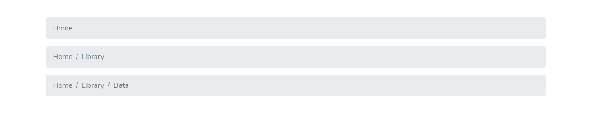
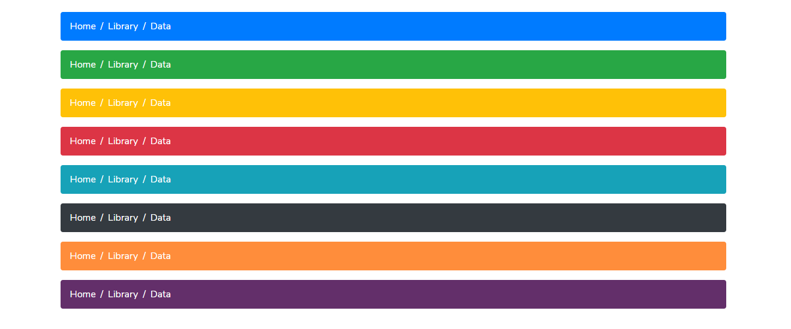

# Breadcrumbs



```markup
<nav aria-label="breadcrumb">
  <ol class="breadcrumb">
    <li class="breadcrumb-item active" aria-current="page">Home</li>
  </ol>
</nav>

<nav aria-label="breadcrumb">
  <ol class="breadcrumb">
    <li class="breadcrumb-item"><a href="#">Home</a></li>
    <li class="breadcrumb-item active" aria-current="page">Library</li>
  </ol>
</nav>

<nav aria-label="breadcrumb">
  <ol class="breadcrumb">
    <li class="breadcrumb-item"><a href="#">Home</a></li>
    <li class="breadcrumb-item"><a href="#">Library</a></li>
    <li class="breadcrumb-item active" aria-current="page">Data</li>
  </ol>
</nav>
```

### Breadcrumbs Colors



```markup
<nav aria-label="breadcrumb">
    <ol class="breadcrumb-primary">
        <li class="breadcrumb-item-rh"><a href="#">Home</a></li>
        <li class="breadcrumb-item-rh"><a href="#">Library</a></li>
        <li class="breadcrumb-item-rh active" aria-current="page">Data</li>
    </ol>
</nav>

<nav aria-label="breadcrumb">
    <ol class="breadcrumb-success">
        <li class="breadcrumb-item-rh"><a href="#">Home</a></li>
        <li class="breadcrumb-item-rh"><a href="#">Library</a></li>
        <li class="breadcrumb-item-rh active" aria-current="page">Data</li>
    </ol>
</nav>

<nav aria-label="breadcrumb">
    <ol class="breadcrumb-warning">
        <li class="breadcrumb-item-rh"><a href="#">Home</a></li>
        <li class="breadcrumb-item-rh"><a href="#">Library</a></li>
        <li class="breadcrumb-item-rh active" aria-current="page">Data</li>
    </ol>
</nav>

<nav aria-label="breadcrumb">
    <ol class="breadcrumb-danger">
        <li class="breadcrumb-item-rh"><a href="#">Home</a></li>
        <li class="breadcrumb-item-rh"><a href="#">Library</a></li>
        <li class="breadcrumb-item-rh active" aria-current="page">Data</li>
    </ol>
</nav>

<nav aria-label="breadcrumb">
    <ol class="breadcrumb-info">
        <li class="breadcrumb-item-rh"><a href="#">Home</a></li>
        <li class="breadcrumb-item-rh"><a href="#">Library</a></li>
        <li class="breadcrumb-item-rh active" aria-current="page">Data</li>
    </ol>
</nav>

<nav aria-label="breadcrumb">
    <ol class="breadcrumb-dark">
        <li class="breadcrumb-item-rh"><a href="#">Home</a></li>
        <li class="breadcrumb-item-rh"><a href="#">Library</a></li>
        <li class="breadcrumb-item-rh active" aria-current="page">Data</li>
    </ol>
</nav>

<nav aria-label="breadcrumb">
    <ol class="breadcrumb-orange">
        <li class="breadcrumb-item-rh"><a href="#">Home</a></li>
        <li class="breadcrumb-item-rh"><a href="#">Library</a></li>
        <li class="breadcrumb-item-rh active" aria-current="page">Data</li>
    </ol>
</nav>

<nav aria-label="breadcrumb">
    <ol class="breadcrumb-purple">
        <li class="breadcrumb-item-rh"><a href="#">Home</a></li>
        <li class="breadcrumb-item-rh"><a href="#">Library</a></li>
        <li class="breadcrumb-item-rh active" aria-current="page">Data</li>
    </ol>
</nav>
```

