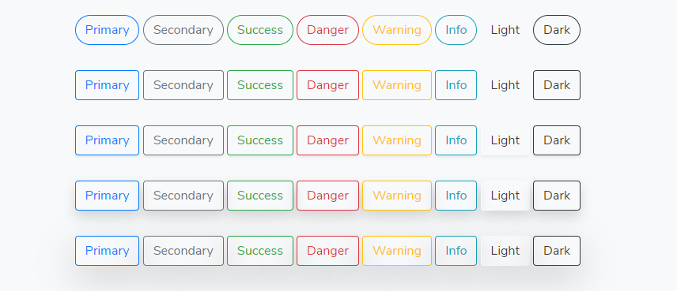

# Buttons


```markup
<button type="button" class="btn btn-primary rounded-pill">Primary</button>
<button type="button" class="btn btn-secondary rounded-pill">Secondary</button>
<button type="button" class="btn btn-success rounded-pill">Success</button>
<button type="button" class="btn btn-danger rounded-pill">Danger</button>
<button type="button" class="btn btn-warning rounded-pill">Warning</button>
<button type="button" class="btn btn-info rounded-pill">Info</button>
<button type="button" class="btn btn-light rounded-pill">Light</button>
<button type="button" class="btn btn-dark rounded-pill">Dark</button>
<button type="button" class="btn btn-link rounded-pill text-primary">Link</button>

<button type="button" class="btn btn-primary">Primary</button>
<button type="button" class="btn btn-secondary">Secondary</button>
<button type="button" class="btn btn-success">Success</button>
<button type="button" class="btn btn-danger">Danger</button>
<button type="button" class="btn btn-warning">Warning</button>
<button type="button" class="btn btn-info">Info</button>
<button type="button" class="btn btn-light">Light</button>
<button type="button" class="btn btn-dark">Dark</button>
<button type="button" class="btn btn-link text-primary">Link</button>

<button type="button" class="btn btn-primary shadow-sm">Primary</button>
<button type="button" class="btn btn-secondary shadow-sm">Secondary</button>
<button type="button" class="btn btn-success shadow-sm">Success</button>
<button type="button" class="btn btn-danger shadow-sm">Danger</button>
<button type="button" class="btn btn-warning shadow-sm">Warning</button>
<button type="button" class="btn btn-info shadow-sm">Info</button>
<button type="button" class="btn btn-light shadow-sm">Light</button>
<button type="button" class="btn btn-dark shadow-sm">Dark</button>
<button type="button" class="btn btn-link shadow-sm text-primary">Link</button>

<button type="button" class="btn btn-primary shadow">Primary</button>
<button type="button" class="btn btn-secondary shadow">Secondary</button>
<button type="button" class="btn btn-success shadow">Success</button>
<button type="button" class="btn btn-danger shadow">Danger</button>
<button type="button" class="btn btn-warning shadow">Warning</button>
<button type="button" class="btn btn-info shadow">Info</button>
<button type="button" class="btn btn-light shadow">Light</button>
<button type="button" class="btn btn-dark shadow">Dark</button>
<button type="button" class="btn btn-link shadow text-primary">Link</button>

<button type="button" class="btn btn-primary shadow-lg">Primary</button>
<button type="button" class="btn btn-secondary shadow-lg">Secondary</button>
<button type="button" class="btn btn-success shadow-lg">Success</button>
<button type="button" class="btn btn-danger shadow-lg">Danger</button>
<button type="button" class="btn btn-warning shadow-lg">Warning</button>
<button type="button" class="btn btn-info shadow-lg">Info</button>
<button type="button" class="btn btn-light shadow-lg">Light</button>
<button type="button" class="btn btn-dark shadow-lg">Dark</button>
<button type="button" class="btn btn-link shadow-lg text-primary">Link</button>

```

### Outline buttons <a id="outline-buttons"></a>



```markup
<button type="button" class="btn btn-outline-primary rounded-pill">Primary</button>
<button type="button" class="btn btn-outline-secondary rounded-pill">Secondary</button>
<button type="button" class="btn btn-outline-success rounded-pill">Success</button>
<button type="button" class="btn btn-outline-danger rounded-pill">Danger</button>
<button type="button" class="btn btn-outline-warning rounded-pill">Warning</button>
<button type="button" class="btn btn-outline-info rounded-pill">Info</button>
<button type="button" class="btn btn-outline-light rounded-pill text-dark">Light</button>
<button type="button" class="btn btn-outline-dark rounded-pill">Dark</button>

<button type="button" class="btn btn-outline-primary">Primary</button>
<button type="button" class="btn btn-outline-secondary">Secondary</button>
<button type="button" class="btn btn-outline-success">Success</button>
<button type="button" class="btn btn-outline-danger">Danger</button>
<button type="button" class="btn btn-outline-warning">Warning</button>
<button type="button" class="btn btn-outline-info">Info</button>
<button type="button" class="btn btn-outline-light text-dark">Light</button>
<button type="button" class="btn btn-outline-dark">Dark</button>

<button type="button" class="btn btn-outline-primary shadow-sm">Primary</button>
<button type="button" class="btn btn-outline-secondary shadow-sm">Secondary</button>
<button type="button" class="btn btn-outline-success shadow-sm">Success</button>
<button type="button" class="btn btn-outline-danger shadow-sm">Danger</button>
<button type="button" class="btn btn-outline-warning shadow-sm">Warning</button>
<button type="button" class="btn btn-outline-info shadow-sm">Info</button>
<button type="button" class="btn btn-outline-light shadow-sm text-dark">Light</button>
<button type="button" class="btn btn-outline-dark shadow-sm">Dark</button>

<button type="button" class="btn btn-outline-primary shadow">Primary</button>
<button type="button" class="btn btn-outline-secondary shadow">Secondary</button>
<button type="button" class="btn btn-outline-success shadow">Success</button>
<button type="button" class="btn btn-outline-danger shadow">Danger</button>
<button type="button" class="btn btn-outline-warning shadow">Warning</button>
<button type="button" class="btn btn-outline-info shadow">Info</button>
<button type="button" class="btn btn-outline-light shadow text-dark">Light</button>
<button type="button" class="btn btn-outline-dark shadow">Dark</button>

<button type="button" class="btn btn-outline-primary shadow-lg">Primary</button>
<button type="button" class="btn btn-outline-secondary shadow-lg">Secondary</button>
<button type="button" class="btn btn-outline-success shadow-lg">Success</button>
<button type="button" class="btn btn-outline-danger shadow-lg">Danger</button>
<button type="button" class="btn btn-outline-warning shadow-lg">Warning</button>
<button type="button" class="btn btn-outline-info shadow-lg">Info</button>
<button type="button" class="btn btn-outline-light shadow-lg text-dark">Light</button>
<button type="button" class="btn btn-outline-dark shadow-lg">Dark</button>

```


