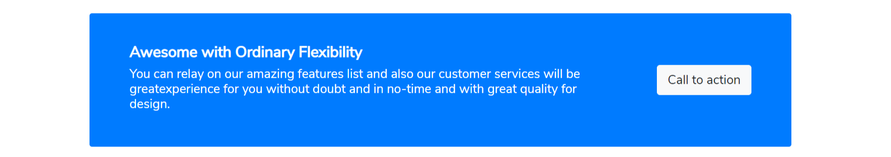
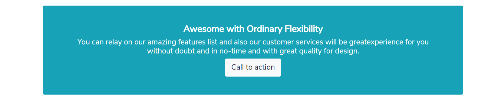
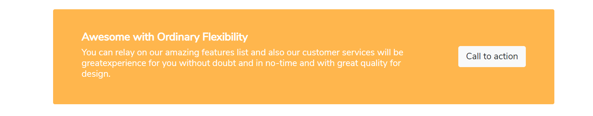
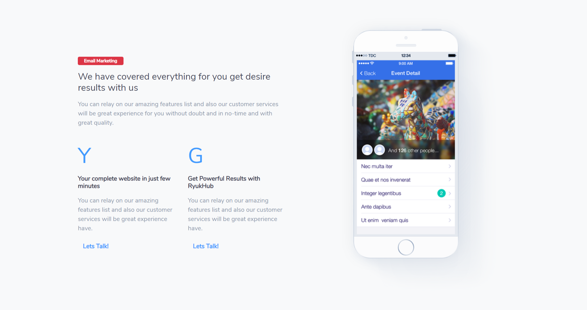

# Call to action



```markup
<div class="jumbotron p-5 jumbotron-fluid bg-primary rounded">
    <div class="container h-100">
        <div class="row justify-content-between align-items-center text-md-center text-lg-left">
            <div class="col-lg-9">
                <h4 class="font-weight-bold text-white">Awesome with Ordinary Flexibility</h4>
                <h5 class="font-weight-light text-white">You can relay on our amazing features list and also our customer services will be greatexperience for you without doubt and in no-time and with great quality for design.</h5>
            </div>
            <div class="col-lg-3 text-md-center text-lg-right mt-4 mb-4">
                <a href="#" class="btn btn-lg btn-light">Call to action</a>
            </div>
        </div>
    </div>
</div>
```



```markup
<div class="jumbotron p-5 jumbotron-fluid bg-info rounded">
    <div class="container text-center h-100">
        <h4 class="font-weight-bold text-white">Awesome with Ordinary Flexibility</h4>
        <h5 class="font-weight-light text-white">You can relay on our amazing features list and also our customer services will be greatexperience for you without doubt and in no-time and with great quality for design.</h5>
        <a href="#" class="btn btn-lg btn-light">Call to action</a>
    </div>
</div>
```



```markup
<div class="jumbotron p-5 jumbotron-fluid bg-warning rounded">
    <div class="container h-100">
        <div class="row justify-content-between align-items-center text-md-center text-lg-left">
            <div class="col-lg-9">
                <h4 class="font-weight-bold text-white">Awesome with Ordinary Flexibility</h4>
                <h5 class="font-weight-light text-white">You can relay on our amazing features list and also our customer services will be greatexperience for you without doubt and in no-time and with great quality for design.</h5>
            </div>
            <div class="col-lg-3 text-md-center text-lg-right mt-4 mb-4">
                <a href="#" class="btn btn-lg btn-light">Call to action</a>
            </div>
        </div>
    </div>
</div>
```


```markup
<section class="pt-5 service border-top">
    <div class="container">
        <div class="row wrap-service">
            <div class="col-lg-6 align-self-center">
                <span class="badge badge-primary px-3 py-1 font-weight-bold">RyukHub Hosting</span>
                <h3 class="my-3 text-uppercase">Extreme power, flexibility and control.</h3>
                <p class="mt-3">Our hosting solutions range from web hosting to blazing-fast dedicated servers. Find it all right here.</p>
                <ul class="list-check">
                    <li class="check">Best for resource -intensive web applications</li>
                    <li class="check">No resource restrictions</li>
                    <li class="check">Full root access - highly customizable</li>
                </ul>
                <a href="#" class="btn btn-primary">Get Started</a>
            </div>
            <div class="col-lg-6">
                
            </div>
        </div>
    </div>
</section>
```


```markup
<section class="service py-5 wrap-feature-box" style="background-image:url('assets/img/kit/line-blue.jpg'), url('assets/img/kit/line-orange.jpg');">
    <div class="container">
        <div class="row">
            <div class="col-lg-6">
                <div class="card border-0 mb-4">
                    <div class="card-body"> <span class="badge badge-danger px-3 py-1 font-weight-bold">Office 365</span>
                        <h3 class="my-3 text-uppercase">Awesome Extra Ordinary Flexibility</h3>
                        <p class="my-4">You can relay on our amazing features list and also our customer services will be great</p>
                        <a class="btn btn-primary" href="#f40">
                            <span>View Details</span>
                        </a>
                    </div>
                </div>
            </div>
            <div class="col-lg-6">
                
            </div>
        </div>
    </div>
</section>
```



```markup
<section class="py-5 bg-light service">
    <div class="container">
        <div class="row">
            <!-- column -->
            <div class="col-lg-6 align-self-center">
                <span class="badge badge-danger px-3 py-1 font-weight-bold">Email Marketing</span>
                <h4 class="my-3">We have covered everything for you get desire results with us</h4>
                <p class="mt-3">You can relay on our amazing features list and also our customer services will be great experience for you without doubt and in no-time and with great quality.</p>
                <div class="row">
                    <div class="col-md-6 mt-4">
                        <span class="text-primary display-4">Y</span>
                        <h6 class="font-weight-bold my-3">Your complete website in just few minutes</h6>
                        <p>You can relay on our amazing features list and also our customer services will be great experience have.</p>
                        <a class="btn btn-link font-weight-bold text-primary" href="#f27">Lets Talk!</a>
                    </div>
                    <div class="col-md-6 mt-4">
                        <span class="text-primary display-4">G</span>
                        <h6 class="font-weight-bold my-3">Get Powerful Results with RyukHub</h6>
                        <p>You can relay on our amazing features list and also our customer services will be great experience have.</p>
                        <a class="btn btn-link font-weight-bold text-primary" href="#f27">Lets Talk!</a>
                    </div>
                </div>
            </div>
            <!-- column -->
            <div class="col-lg-6 text-center">
                
            </div>
        </div>
    </div>
</section>
```

