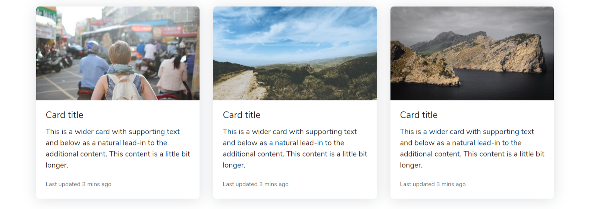
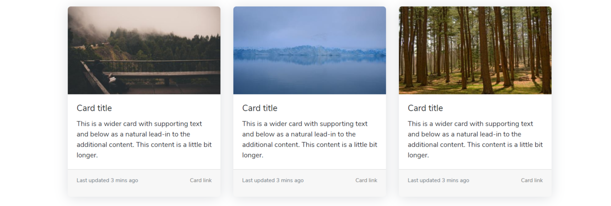
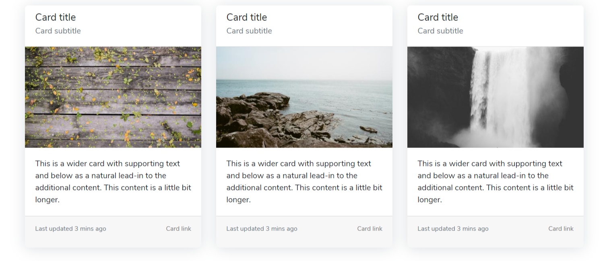
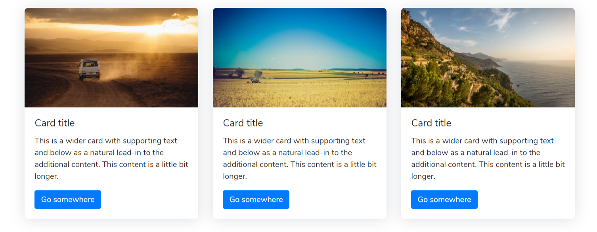

# Cards

### Cards With Images

This is 3 column contents



```markup
<div class="row">
    <div class="col-lg-4">
        <div class="card">
            
            <div class="card-body">
                <h5 class="card-title">Card title</h5>
                <p class="card-text">This is a wider card with supporting text and below as a natural lead-in to the additional content. This content is a little bit longer.</p>
                <p class="card-text"><small class="text-muted">Last updated 3 mins ago</small>
                </p>
            </div>
        </div>
    </div>
    <!-- End Col -->
    <div class="col-lg-4">
        <div class="card">
            
            <div class="card-body">
                <h5 class="card-title">Card title</h5>
                <p class="card-text">This is a wider card with supporting text and below as a natural lead-in to the additional content. This content is a little bit longer.</p>
                <p class="card-text"><small class="text-muted">Last updated 3 mins ago</small>
                </p>
            </div>
        </div>
    </div>
    <!-- End Col -->
    <div class="col-lg-4">
        <div class="card">
            
            <div class="card-body">
                <h5 class="card-title">Card title</h5>
                <p class="card-text">This is a wider card with supporting text and below as a natural lead-in to the additional content. This content is a little bit longer.</p>
                <p class="card-text"><small class="text-muted">Last updated 3 mins ago</small>
                </p>
            </div>
        </div>
    </div>
    <!-- End Col -->
</div>
```

### Cards With Footer and Links

This is 3 column contents



```markup
<div class="row">
    <div class="col-12 mb-5">
        <h4 class="d-inline-flex">Cards With Footer and Links</h4>
        <p class="text-muted">This is 3 column contents</p>
        <div class="row">
            <div class="col-lg-4">
                <div class="card">
                    
                    <div class="card-body">
                        <h5 class="card-title">Card title</h5>
                        <p class="card-text">This is a wider card with supporting text and below as a natural lead-in to the additional content. This content is a little bit longer.</p>
                    </div>
                    <div class="card-footer">
                        <p class="card-text d-inline-flex"><small class="text-muted">Last updated 3 mins ago</small>
                        </p><a href="#" class="card-link float-right"><small>Card link</small></a>
                    </div>
                </div>
            </div>
            <!-- End Col -->
            <div class="col-lg-4">
                <div class="card">
                    
                    <div class="card-body">
                        <h5 class="card-title">Card title</h5>
                        <p class="card-text">This is a wider card with supporting text and below as a natural lead-in to the additional content. This content is a little bit longer.</p>
                    </div>
                    <div class="card-footer">
                        <p class="card-text d-inline-flex"><small class="text-muted">Last updated 3 mins ago</small>
                        </p><a href="#" class="card-link float-right"><small>Card link</small></a>
                    </div>
                </div>
            </div>
            <!-- End Col -->
            <div class="col-lg-4">
                <div class="card">
                    
                    <div class="card-body">
                        <h5 class="card-title">Card title</h5>
                        <p class="card-text">This is a wider card with supporting text and below as a natural lead-in to the additional content. This content is a little bit longer.</p>
                    </div>
                    <div class="card-footer">
                        <p class="card-text d-inline-flex"><small class="text-muted">Last updated 3 mins ago</small>
                        </p><a href="#" class="card-link float-right"><small>Card link</small></a>
                    </div>
                </div>
            </div>
            <!-- End Col -->
        </div>
    </div>
</div>
```

### Cards With Header, Footer and Links

This is 3 column contents



```markup
<div class="row">
    <div class="col-lg-4">
        <div class="card">
            <div class="card-header bg-white">
                <h5 class="card-title">Card title</h5>
                <h6 class="card-subtitle mb-2 text-muted">Card subtitle</h6>
            </div>
            
            <div class="card-body">
                <p class="card-text">This is a wider card with supporting text and below as a natural lead-in to the additional content. This content is a little bit longer.</p>
            </div>
            <div class="card-footer">
                <p class="card-text d-inline-flex"><small class="text-muted">Last updated 3 mins ago</small>
                </p><a href="#" class="card-link float-right"><small>Card link</small></a>
            </div>
        </div>
    </div>
    <!-- End Col -->
    <div class="col-lg-4">
        <div class="card">
            <div class="card-header bg-white">
                <h5 class="card-title">Card title</h5>
                <h6 class="card-subtitle mb-2 text-muted">Card subtitle</h6>
            </div>
            
            <div class="card-body">
                <p class="card-text">This is a wider card with supporting text and below as a natural lead-in to the additional content. This content is a little bit longer.</p>
            </div>
            <div class="card-footer">
                <p class="card-text d-inline-flex"><small class="text-muted">Last updated 3 mins ago</small>
                </p><a href="#" class="card-link float-right"><small>Card link</small></a>
            </div>
        </div>
    </div>
    <!-- End Col -->
    <div class="col-lg-4">
        <div class="card">
            <div class="card-header bg-white">
                <h5 class="card-title">Card title</h5>
                <h6 class="card-subtitle mb-2 text-muted">Card subtitle</h6>
            </div>
            
            <div class="card-body">
                <p class="card-text">This is a wider card with supporting text and below as a natural lead-in to the additional content. This content is a little bit longer.</p>
            </div>
            <div class="card-footer">
                <p class="card-text d-inline-flex"><small class="text-muted">Last updated 3 mins ago</small>
                </p><a href="#" class="card-link float-right"><small>Card link</small></a>
            </div>
        </div>
    </div>
</div>
```

### Cards With Button

This is 3 column contents



```markup
<div class="row">
    <div class="col-12 mb-5">
        <h4 class="d-inline-flex">Cards With Button</h4>
        <p class="text-muted">This is 3 column contents</p>
        <div class="row">
            <div class="col-lg-4">
                <div class="card">
                    
                    <div class="card-body">
                        <h5 class="card-title">Card title</h5>
                        <p class="card-text">This is a wider card with supporting text and below as a natural lead-in to the additional content. This content is a little bit longer.</p><a href="#" class="btn btn-primary">Go somewhere</a>
                    </div>
                </div>
            </div>
            <!-- End Col -->
            <div class="col-lg-4">
                <div class="card">
                    
                    <div class="card-body">
                        <h5 class="card-title">Card title</h5>
                        <p class="card-text">This is a wider card with supporting text and below as a natural lead-in to the additional content. This content is a little bit longer.</p><a href="#" class="btn btn-primary">Go somewhere</a>
                    </div>
                </div>
            </div>
            <!-- End Col -->
            <div class="col-lg-4">
                <div class="card">
                    
                    <div class="card-body">
                        <h5 class="card-title">Card title</h5>
                        <p class="card-text">This is a wider card with supporting text and below as a natural lead-in to the additional content. This content is a little bit longer.</p><a href="#" class="btn btn-primary">Go somewhere</a>
                    </div>
                </div>
            </div>
            <!-- End Col -->
        </div>
    </div>
</div>
```


