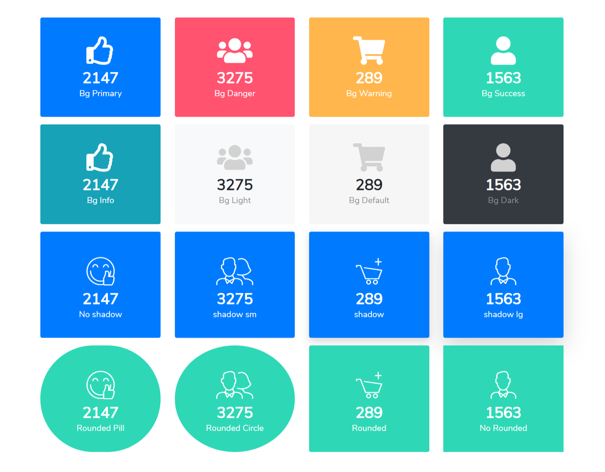

# Counters



```markup
<section id="Counter" class="my-5">
    <div class="container">
        <div class="row">
            <div class="col-md-3">
                <div class="counter-box bg-primary rounded">
                    <i class="fa fa-thumbs-o-up" aria-hidden="true"></i>
                    <span class="counter-count">2147</span>
                    <p>Bg Primary</p>
                </div>
            </div>
            <div class="col-md-3">
                <div class="counter-box bg-danger rounded">
                    <i class="fa fa-group" aria-hidden="true"></i>
                    <span class="counter-count">3275</span>
                    <p>Bg Danger</p>
                </div>
            </div>
            <div class="col-md-3">
                <div class="counter-box bg-warning rounded">
                    <i class="fa fa-shopping-cart" aria-hidden="true"></i>
                    <span class="counter-count">289</span>
                    <p>Bg Warning</p>
                </div>
            </div>
            <div class="col-md-3">
                <div class="counter-box bg-success rounded">
                    <i class="fa fa-user" aria-hidden="true"></i>
                    <span class="counter-count">1563</span>
                    <p>Bg Success</p>
                </div>
            </div>
        </div>
        <div class="row mt-3">
            <div class="col-md-3">
                <div class="counter-box bg-info rounded">
                    <i class="fa fa-thumbs-o-up" aria-hidden="true"></i>
                    <span class="counter-count">2147</span>
                    <p>Bg Info</p>
                </div>
            </div>
            <div class="col-md-3">
                <div class="counter-box bg-light rounded">
                    <i class="fa fa-group" aria-hidden="true"></i>
                    <span class="counter-count">3275</span>
                    <p>Bg Light</p>
                </div>
            </div>
            <div class="col-md-3">
                <div class="counter-box rounded">
                    <i class="fa fa-shopping-cart" aria-hidden="true"></i>
                    <span class="counter-count">289</span>
                    <p>Bg Default</p>
                </div>
            </div>
            <div class="col-md-3">
                <div class="counter-box bg-dark rounded">
                    <i class="fa fa-user" aria-hidden="true"></i>
                    <span class="counter-count">1563</span>
                    <p>Bg Dark</p>
                </div>
            </div>
        </div>
        <div class="row mt-3">
            <div class="col-md-3">
                <div class="counter-box bg-primary rounded">
                    <i class="im im-icon-Thumbs-UpSmiley"></i>
                    <span class="counter-count">2147</span>
                    <p>No shadow</p>
                </div>
            </div>
            <div class="col-md-3">
                <div class="counter-box bg-primary rounded shadow-sm">
                    <i class="im im-icon-Business-ManWoman"></i>
                    <span class="counter-count">3275</span>
                    <p>shadow sm</p>
                </div>
            </div>
            <div class="col-md-3">
                <div class="counter-box bg-primary rounded shadow">
                    <i class="im im-icon-Add-Cart"></i>
                    <span class="counter-count">289</span>
                    <p>shadow</p>
                </div>
            </div>
            <div class="col-md-3">
                <div class="counter-box bg-primary rounded shadow-lg">
                    <i class="im im-icon-Business-Man"></i>
                    <span class="counter-count">1563</span>
                    <p>shadow lg</p>
                </div>
            </div>
        </div>
        <div class="row mt-3">
            <div class="col-md-3">
                <div class="counter-box bg-success rounded-pill">
                    <i class="im im-icon-Thumbs-UpSmiley"></i>
                    <span class="counter-count">2147</span>
                    <p>Rounded Pill</p>
                </div>
            </div>
            <div class="col-md-3">
                <div class="counter-box bg-success rounded-circle">
                    <i class="im im-icon-Business-ManWoman"></i>
                    <span class="counter-count">3275</span>
                    <p>Rounded Circle</p>
                </div>
            </div>
            <div class="col-md-3">
                <div class="counter-box bg-success rounded">
                    <i class="im im-icon-Add-Cart"></i>
                    <span class="counter-count">289</span>
                    <p>Rounded</p>
                </div>
            </div>
            <div class="col-md-3">
                <div class="counter-box bg-success">
                    <i class="im im-icon-Business-Man"></i>
                    <span class="counter-count">1563</span>
                    <p>No Rounded</p>
                </div>
            </div>
        </div>
    </div>
</section>
```

