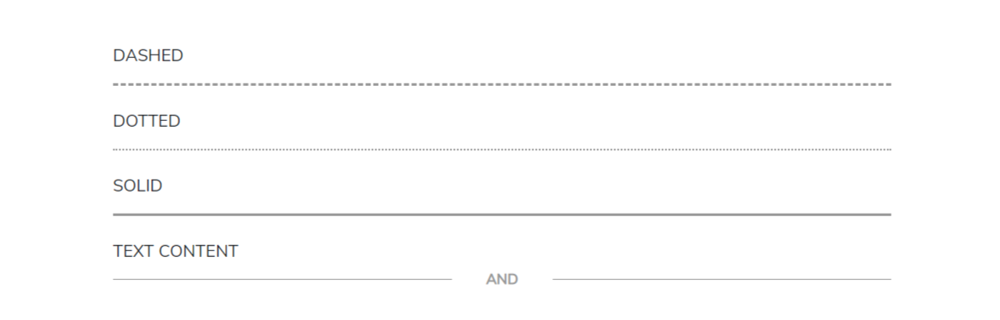
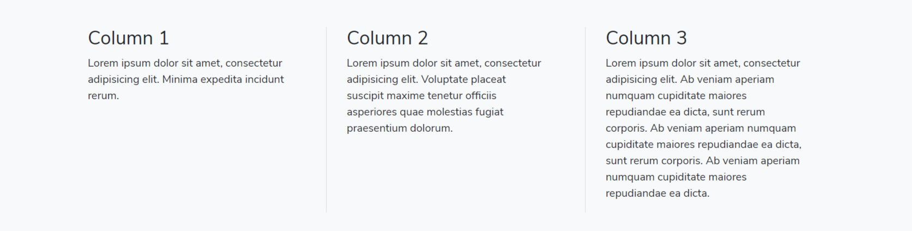

# Dividers

### Divider

Some divider variants using  element.



```markup
<div class="row">
    <div class="col-lg-8 mx-auto">
        <div class="mb-4">
            <h6 class="text-uppercase">Dashed</h6>
            <!-- Dashed divider -->
            <hr class="dashed">
        </div>
        <div class="mb-4">
            <h6 class="text-uppercase">Dotted</h6>
            <!-- Dotted divider -->
            <hr class="dotted">
        </div>
        <div class="mb-4">
            <h6 class="text-uppercase">Solid</h6>
            <!-- Solid divider -->
            <hr class="solid">
        </div>
        <div class="mb-4">
            <h6 class="text-uppercase">Text content</h6>
            <!-- Gradient divider -->
            <hr data-content="AND" class="hr-text">
        </div>
    </div>
</div>
```

### Grid Divider

Add the \(.grid-divider\) class to any row to separate grid columns with equal height lines.



```markup
<div class="row grid-divider">
    <div class="col-sm-4">
        <div class="col-padding">
            <h3>Column 1</h3>
            <p>Lorem ipsum dolor sit amet, consectetur adipisicing elit. Minima expedita incidunt rerum.</p>
        </div>
    </div>
    <div class="col-sm-4">
        <div class="col-padding">
            <h3>Column 2</h3>
            <p>Lorem ipsum dolor sit amet, consectetur adipisicing elit. Voluptate placeat suscipit maxime tenetur officiis asperiores quae molestias fugiat praesentium dolorum.</p>
        </div>
    </div>
    <div class="col-sm-4">
        <div class="col-padding">
            <h3>Column 3</h3>
            <p>
                Lorem ipsum dolor sit amet, consectetur adipisicing elit. Ab veniam aperiam numquam cupiditate maiores repudiandae ea dicta, sunt rerum corporis. Ab veniam aperiam numquam cupiditate maiores repudiandae ea dicta, sunt rerum corporis. Ab veniam aperiam
                numquam cupiditate maiores repudiandae ea dicta.
            </p>
        </div>
    </div>
</div>
```

