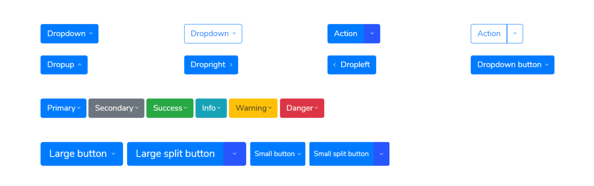

# Dropdowns



```markup
<div class="row my-5">
    <div class="col-6 col-sm-6 col-md-3 mb-4">
        <div class="dropdown">
            <button class="btn btn-primary dropdown-toggle" type="button" data-toggle="dropdown" aria-haspopup="true" aria-expanded="false">
    							Dropdown
    				</button>
            <div class="dropdown-menu">
                <a class="dropdown-item" href="#">Action</a>
                <a class="dropdown-item" href="#">Another action</a>
                <a class="dropdown-item" href="#">Something else here</a>
            </div>
        </div>
    </div>
    <div class="col-6 col-sm-6 col-md-3">
        <div class="dropdown">
            <button class="btn btn-outline-primary dropdown-toggle" type="button" data-toggle="dropdown" aria-haspopup="true" aria-expanded="false">
    							Dropdown
    				</button>
            <div class="dropdown-menu">
                <a class="dropdown-item" href="#">Action</a>
                <a class="dropdown-item" href="#">Another action</a>
                <a class="dropdown-item" href="#">Something else here</a>
            </div>
        </div>
    </div>
    <div class="col-6 col-sm-6 col-md-3 mb-4">
        <div class="btn-group">
            <button type="button" class="btn btn-primary">Action</button>
            <button type="button" class="btn btn-primary dropdown-toggle dropdown-toggle-split" data-toggle="dropdown" aria-haspopup="true" aria-expanded="false">
    							<span class="sr-only">Toggle Dropdown</span>
    				</button>
            <div class="dropdown-menu">
                <a class="dropdown-item" href="#">Action</a>
                <a class="dropdown-item" href="#">Another action</a>
                <a class="dropdown-item" href="#">Something else here</a>
                <div class="dropdown-divider"></div>
                <a class="dropdown-item" href="#">Separated link</a>
            </div>
        </div>
    </div>
    <div class="col-6 col-sm-6 col-md-3">
        <div class="btn-group">
            <button type="button" class="btn btn-outline-primary">Action</button>
            <button type="button" class="btn btn-outline-primary dropdown-toggle dropdown-toggle-split" data-toggle="dropdown" aria-haspopup="true" aria-expanded="false">
    							<span class="sr-only">Toggle Dropdown</span>
    				</button>
            <div class="dropdown-menu" style="">
                <a class="dropdown-item" href="#">Action</a>
                <a class="dropdown-item" href="#">Another action</a>
                <a class="dropdown-item" href="#">Something else here</a>
                <div class="dropdown-divider"></div>
                <a class="dropdown-item" href="#">Separated link</a>
            </div>
        </div>
    </div>
    <div class="col-6 col-sm-6 col-md-3 mb-4">
        <div class="btn-group dropup">
            <button class="btn btn-primary dropdown-toggle" type="button" data-toggle="dropdown" aria-haspopup="true" aria-expanded="false">
    							Dropup
    				</button>
            <div class="dropdown-menu">
                <a class="dropdown-item" href="#">Action</a>
                <a class="dropdown-item" href="#">Another action</a>
                <a class="dropdown-item" href="#">Something else here</a>
                <div class="dropdown-divider"></div>
                <a class="dropdown-item" href="#">Separated link</a>
            </div>
        </div>
    </div>
    <div class="col-6 col-sm-6 col-md-3">
        <div class="btn-group dropright">
            <button class="btn btn-primary dropdown-toggle" type="button" data-toggle="dropdown" aria-haspopup="true" aria-expanded="false">
    							Dropright
    				</button>
            <div class="dropdown-menu">
                <a class="dropdown-item" href="#">Action</a>
                <a class="dropdown-item" href="#">Another action</a>
                <a class="dropdown-item" href="#">Something else here</a>
                <div class="dropdown-divider"></div>
                <a class="dropdown-item" href="#">Separated link</a>
            </div>
        </div>
    </div>
    <div class="col-6 col-sm-6 col-md-3">
        <div class="btn-group dropleft">
            <button class="btn btn-primary dropdown-toggle" type="button" data-toggle="dropdown" aria-haspopup="true" aria-expanded="false">
    							Dropleft
    				</button>
            <div class="dropdown-menu">
                <a class="dropdown-item" href="#">Action</a>
                <a class="dropdown-item" href="#">Another action</a>
                <a class="dropdown-item" href="#">Something else here</a>
                <div class="dropdown-divider"></div>
                <a class="dropdown-item" href="#">Separated link</a>
            </div>
        </div>
    </div>
    <div class="col-6 col-sm-6 col-md-3">
        <div class="dropdown">
            <button class="btn btn-primary dropdown-toggle" type="button" data-toggle="dropdown" aria-haspopup="true" aria-expanded="false">
    						  Dropdown button
    				</button>
            <div class="dropdown-menu">
                <h6 class="dropdown-header">Dropdown header</h6>
                <a class="dropdown-item" href="#">Action</a>
                <a class="dropdown-item active" href="#">Active</a>
                <a class="dropdown-item disabled" href="#">Disabled</a>
                <div class="dropdown-divider"></div>
                <a class="dropdown-item" href="#">Another action</a>
            </div>
        </div>
    </div>
    <div class="col-12 my-4">
        <div class="bd-example">
            <div class="btn-group">
                <button type="button" class="btn btn-primary dropdown-toggle" data-toggle="dropdown" aria-haspopup="true" aria-expanded="false">Primary</button>
                <div class="dropdown-menu">
                    <a class="dropdown-item" href="#">Action</a>
                    <a class="dropdown-item" href="#">Another action</a>
                    <a class="dropdown-item" href="#">Something else here</a>
                    <div class="dropdown-divider"></div>
                    <a class="dropdown-item" href="#">Separated link</a>
                </div>
            </div>
            <!-- /btn-group -->
            <div class="btn-group">
                <button type="button" class="btn btn-secondary dropdown-toggle" data-toggle="dropdown" aria-haspopup="true" aria-expanded="false">Secondary</button>
                <div class="dropdown-menu">
                    <a class="dropdown-item" href="#">Action</a>
                    <a class="dropdown-item" href="#">Another action</a>
                    <a class="dropdown-item" href="#">Something else here</a>
                    <div class="dropdown-divider"></div>
                    <a class="dropdown-item" href="#">Separated link</a>
                </div>
            </div>
            <!-- /btn-group -->
            <div class="btn-group">
                <button type="button" class="btn btn-success dropdown-toggle" data-toggle="dropdown" aria-haspopup="true" aria-expanded="false">Success</button>
                <div class="dropdown-menu">
                    <a class="dropdown-item" href="#">Action</a>
                    <a class="dropdown-item" href="#">Another action</a>
                    <a class="dropdown-item" href="#">Something else here</a>
                    <div class="dropdown-divider"></div>
                    <a class="dropdown-item" href="#">Separated link</a>
                </div>
            </div>
            <!-- /btn-group -->
            <div class="btn-group">
                <button type="button" class="btn btn-info dropdown-toggle" data-toggle="dropdown" aria-haspopup="true" aria-expanded="false">Info</button>
                <div class="dropdown-menu">
                    <a class="dropdown-item" href="#">Action</a>
                    <a class="dropdown-item" href="#">Another action</a>
                    <a class="dropdown-item" href="#">Something else here</a>
                    <div class="dropdown-divider"></div>
                    <a class="dropdown-item" href="#">Separated link</a>
                </div>
            </div>
            <!-- /btn-group -->
            <div class="btn-group">
                <button type="button" class="btn btn-warning dropdown-toggle" data-toggle="dropdown" aria-haspopup="true" aria-expanded="false">Warning</button>
                <div class="dropdown-menu">
                    <a class="dropdown-item" href="#">Action</a>
                    <a class="dropdown-item" href="#">Another action</a>
                    <a class="dropdown-item" href="#">Something else here</a>
                    <div class="dropdown-divider"></div>
                    <a class="dropdown-item" href="#">Separated link</a>
                </div>
            </div>
            <!-- /btn-group -->
            <div class="btn-group">
                <button type="button" class="btn btn-danger dropdown-toggle" data-toggle="dropdown" aria-haspopup="true" aria-expanded="false">Danger</button>
                <div class="dropdown-menu">
                    <a class="dropdown-item" href="#">Action</a>
                    <a class="dropdown-item" href="#">Another action</a>
                    <a class="dropdown-item" href="#">Something else here</a>
                    <div class="dropdown-divider"></div>
                    <a class="dropdown-item" href="#">Separated link</a>
                </div>
            </div>
            <!-- /btn-group -->
        </div>
    </div>
    <div class="col-12 my-4">
        <div class="btn-toolbar" role="toolbar">
            <div class="btn-group">
                <button class="btn btn-primary btn-lg dropdown-toggle" type="button" data-toggle="dropdown" aria-haspopup="true" aria-expanded="false">
    							  Large button
    						</button>
                <div class="dropdown-menu">
                    <a class="dropdown-item" href="#">Action</a>
                    <a class="dropdown-item" href="#">Another action</a>
                    <a class="dropdown-item" href="#">Something else here</a>
                    <div class="dropdown-divider"></div>
                    <a class="dropdown-item" href="#">Separated link</a>
                </div>
            </div>
            <!-- /btn-group -->
            <div class="btn-group ml-2">
                <button type="button" class="btn btn-lg btn-primary">Large split button</button>
                <button type="button" class="btn btn-lg btn-primary dropdown-toggle dropdown-toggle-split" data-toggle="dropdown" aria-haspopup="true" aria-expanded="false">
    							  <span class="sr-only">Toggle Dropdown</span>
    						</button>
                <div class="dropdown-menu">
                    <a class="dropdown-item" href="#">Action</a>
                    <a class="dropdown-item" href="#">Another action</a>
                    <a class="dropdown-item" href="#">Something else here</a>
                    <div class="dropdown-divider"></div>
                    <a class="dropdown-item" href="#">Separated link</a>
                </div>
            </div>
            <!-- /btn-group -->
    
            <div class="btn-group ml-2">
                <button class="btn btn-primary btn-sm dropdown-toggle" type="button" data-toggle="dropdown" aria-haspopup="true" aria-expanded="false">
    							  Small button
    						</button>
                <div class="dropdown-menu">
                    <a class="dropdown-item" href="#">Action</a>
                    <a class="dropdown-item" href="#">Another action</a>
                    <a class="dropdown-item" href="#">Something else here</a>
                    <div class="dropdown-divider"></div>
                    <a class="dropdown-item" href="#">Separated link</a>
                </div>
            </div>
            <!-- /btn-group -->
            <div class="btn-group ml-2">
                <button type="button" class="btn btn-sm btn-primary">Small split button</button>
                <button type="button" class="btn btn-sm btn-primary dropdown-toggle dropdown-toggle-split" data-toggle="dropdown" aria-haspopup="true" aria-expanded="false">
    							  <span class="sr-only">Toggle Dropdown</span>
    						</button>
                <div class="dropdown-menu">
                    <a class="dropdown-item" href="#">Action</a>
                    <a class="dropdown-item" href="#">Another action</a>
                    <a class="dropdown-item" href="#">Something else here</a>
                    <div class="dropdown-divider"></div>
                    <a class="dropdown-item" href="#">Separated link</a>
                </div>
            </div>
            <!-- /btn-group -->
        </div>
        <!-- /btn-toolbar -->
    </div>
</div>
```

