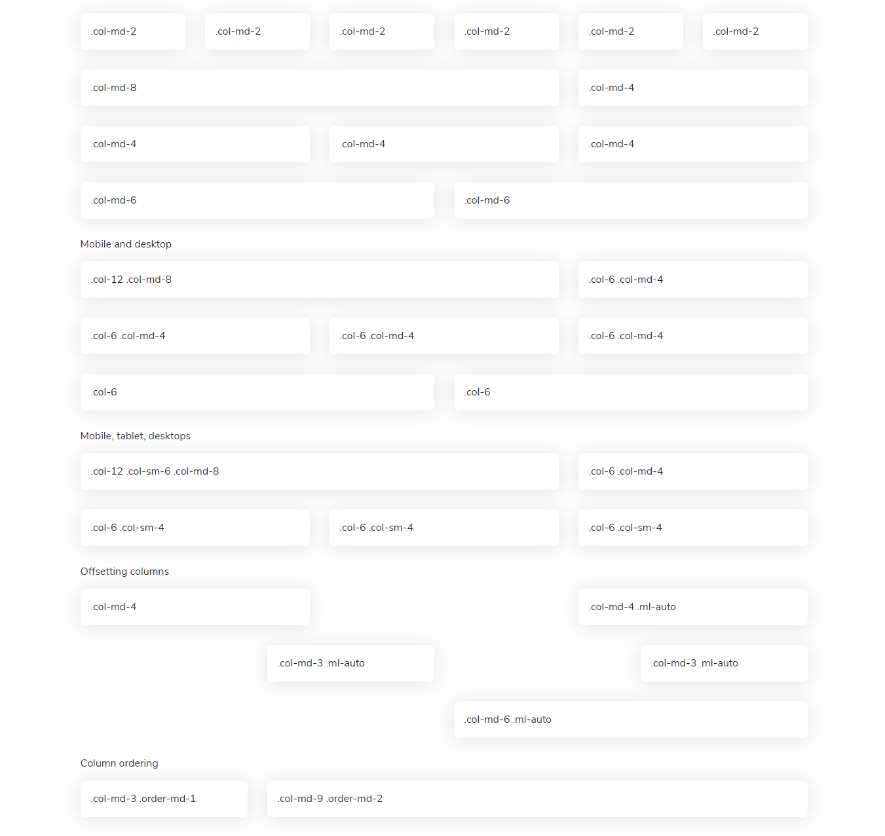

# Grid

See how aspects of the Bootstrap grid system work across multiple devices with a handy table.

|  | Extra small &lt;576px | Small ≥576px | Medium ≥768px | Large ≥992px | Extra large ≥1200px |
| :--- | :--- | :--- | :--- | :--- | :--- |
| Max container width | None \(auto\) | 540px | 720px | 960px | 1140px |
| Class prefix | `.col-` | `.col-sm-` | `.col-md-` | `.col-lg-` | `.col-xl-` |
| \# of columns | 12 |  |  |  |  |
| Gutter width | 30px \(15px on each side of a column\) |  |  |  |  |
| Nestable | Yes |  |  |  |  |
| Column ordering | Yes |  |  |  |  |

