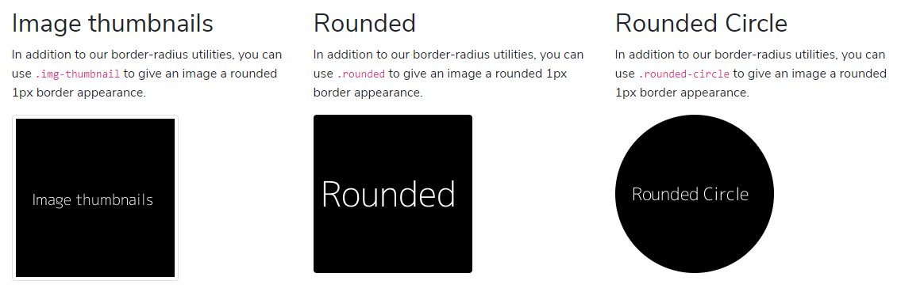

# Images

## Responsive images

Images in Bootstrap are made responsive with `.img-fluid`. `max-width: 100%;` and `height: auto;` are applied to the image so that it scales with the parent element.


## Image thumbnails

```markup

```



```markup


```


