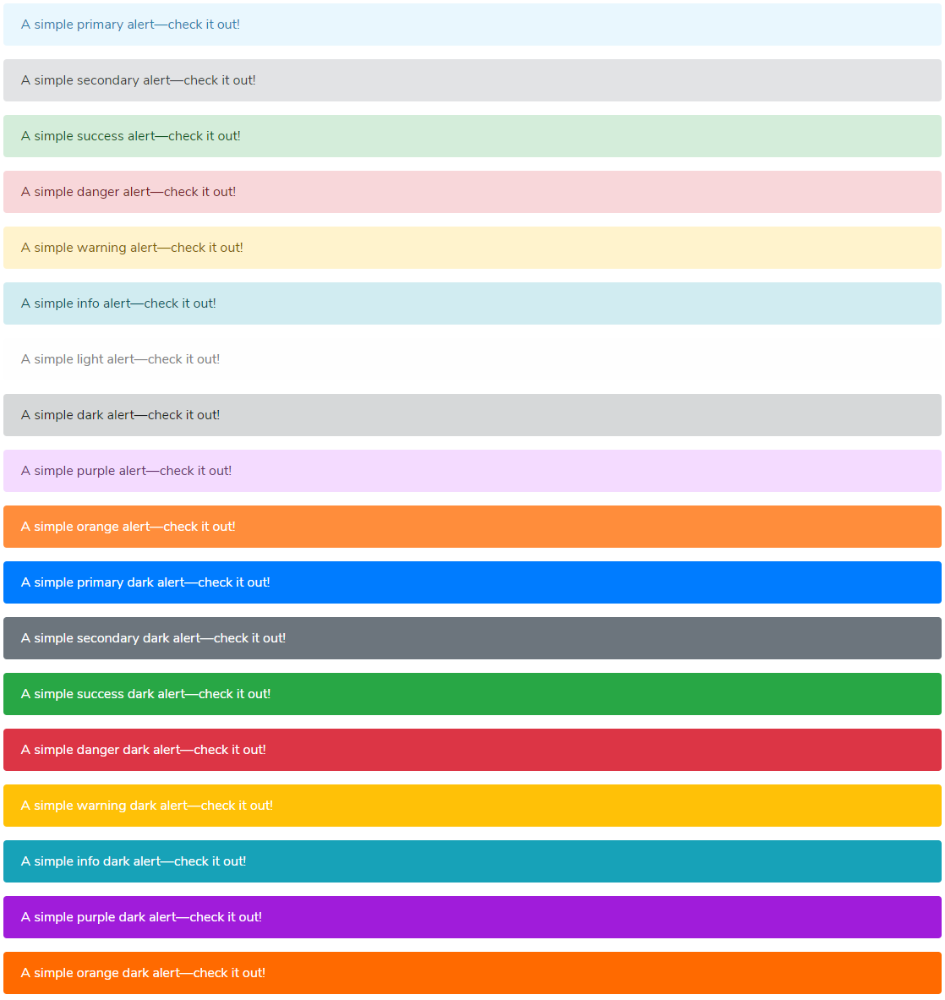
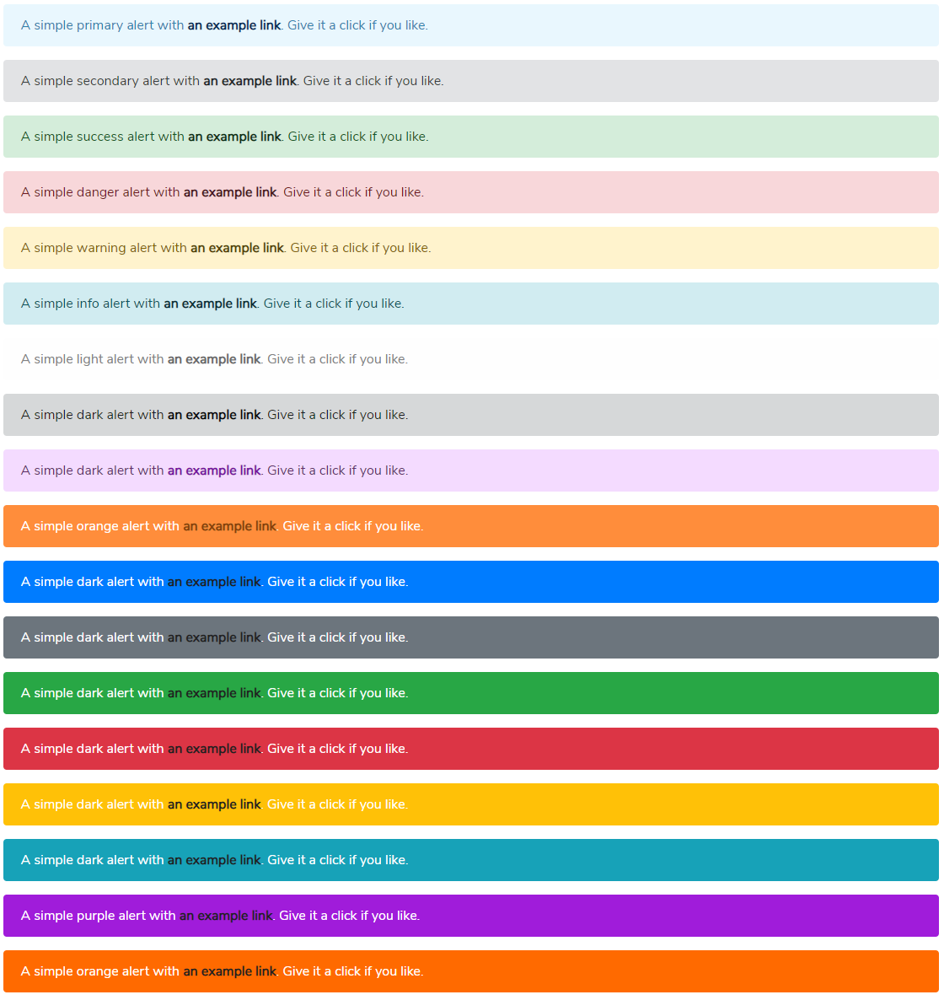
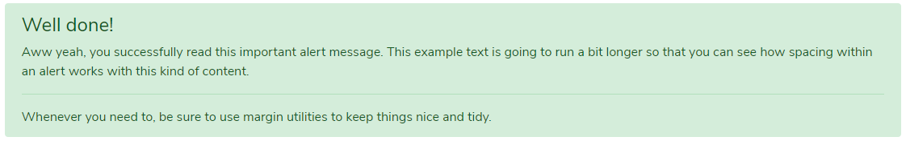

# Message Alert

### Alert Default



### Link Color



### Aditional Content



### Dismissing


```markup
<div class="row">
    <h3>Alert Default</h3>
    <div class="col-12">
        <div class="alert alert-primary" role="alert">
            A simple primary alert—check it out!
        </div>
        <div class="alert alert-secondary" role="alert">
            A simple secondary alert—check it out!
        </div>
        <div class="alert alert-success" role="alert">
            A simple success alert—check it out!
        </div>
        <div class="alert alert-danger" role="alert">
            A simple danger alert—check it out!
        </div>
        <div class="alert alert-warning" role="alert">
            A simple warning alert—check it out!
        </div>
        <div class="alert alert-info" role="alert">
            A simple info alert—check it out!
        </div>
        <div class="alert alert-light" role="alert">
            A simple light alert—check it out!
        </div>
        <div class="alert alert-dark" role="alert">
            A simple dark alert—check it out!
        </div>
        <div class="alert alert-purple" role="alert">
            A simple purple alert—check it out!
        </div>
        <div class="alert alert-orange" role="alert">
            A simple orange alert—check it out!
        </div>
        <div class="alert alert-primary-dark" role="alert">
            A simple primary dark alert—check it out!
        </div>
        <div class="alert alert-secondary-dark" role="alert">
            A simple secondary dark alert—check it out!
        </div>
        <div class="alert alert-success-dark" role="alert">
            A simple success dark alert—check it out!
        </div>
        <div class="alert alert-danger-dark" role="alert">
            A simple danger dark alert—check it out!
        </div>
        <div class="alert alert-warning-dark" role="alert">
            A simple warning dark alert—check it out!
        </div>
        <div class="alert alert-info-dark" role="alert">
            A simple info dark alert—check it out!
        </div>
        <div class="alert alert-purple-dark" role="alert">
            A simple purple dark alert—check it out!
        </div>
        <div class="alert alert-orange-dark" role="alert">
            A simple orange dark alert—check it out!
        </div>
    </div>
</div>
<hr>
<div class="row">
    <h3>Link Color</h3>
    <div class="col-12">
        <div class="alert alert-primary" role="alert">
            A simple primary alert with <a href="#" class="alert-link">an example link</a>. Give it a click if you like.
        </div>
        <div class="alert alert-secondary" role="alert">
            A simple secondary alert with <a href="#" class="alert-link">an example link</a>. Give it a click if you like.
        </div>
        <div class="alert alert-success" role="alert">
            A simple success alert with <a href="#" class="alert-link">an example link</a>. Give it a click if you like.
        </div>
        <div class="alert alert-danger" role="alert">
            A simple danger alert with <a href="#" class="alert-link">an example link</a>. Give it a click if you like.
        </div>
        <div class="alert alert-warning" role="alert">
            A simple warning alert with <a href="#" class="alert-link">an example link</a>. Give it a click if you like.
        </div>
        <div class="alert alert-info" role="alert">
            A simple info alert with <a href="#" class="alert-link">an example link</a>. Give it a click if you like.
        </div>
        <div class="alert alert-light" role="alert">
            A simple light alert with <a href="#" class="alert-link">an example link</a>. Give it a click if you like.
        </div>
        <div class="alert alert-dark" role="alert">
            A simple dark alert with <a href="#" class="alert-link">an example link</a>. Give it a click if you like.
        </div>
        <div class="alert alert-purple" role="alert">
            A simple dark alert with <a href="#" class="alert-link">an example link</a>. Give it a click if you like.
        </div>
        <div class="alert alert-orange" role="alert">
            A simple orange alert with <a href="#" class="alert-link">an example link</a>. Give it a click if you like.
        </div>
        <div class="alert alert-primary-dark" role="alert">
            A simple dark alert with <a href="#" class="alert-link">an example link</a>. Give it a click if you like.
        </div>
        <div class="alert alert-secondary-dark" role="alert">
            A simple dark alert with <a href="#" class="alert-link">an example link</a>. Give it a click if you like.
        </div>
        <div class="alert alert-success-dark" role="alert">
            A simple dark alert with <a href="#" class="alert-link">an example link</a>. Give it a click if you like.
        </div>
        <div class="alert alert-danger-dark" role="alert">
            A simple dark alert with <a href="#" class="alert-link">an example link</a>. Give it a click if you like.
        </div>
        <div class="alert alert-warning-dark" role="alert">
            A simple dark alert with <a href="#" class="alert-link">an example link</a>. Give it a click if you like.
        </div>
        <div class="alert alert-info-dark" role="alert">
            A simple dark alert with <a href="#" class="alert-link">an example link</a>. Give it a click if you like.
        </div>
        <div class="alert alert-purple-dark" role="alert">
            A simple purple alert with <a href="#" class="alert-link">an example link</a>. Give it a click if you like.
        </div>
        <div class="alert alert-orange-dark" role="alert">
            A simple orange alert with <a href="#" class="alert-link">an example link</a>. Give it a click if you like.
        </div>
    </div>
</div>
<hr>
<div class="row">
    <h3>Aditional Content</h3>
    <div class="col-12">
        <div class="alert alert-success" role="alert">
            <h4 class="alert-heading">Well done!</h4>
            <p>Aww yeah, you successfully read this important alert message. This example text is going to run a bit longer so that you can see how spacing within an alert works with this kind of content.</p>
            <hr>
            <p class="mb-0">Whenever you need to, be sure to use margin utilities to keep things nice and tidy.</p>
        </div>
    </div>
</div>
<hr>
<div class="row">
    <h3>Dismissing</h3>
    <div class="col-12">
        <div class="alert alert-warning alert-dismissible fade show" role="alert">
            <strong>Holy guacamole!</strong> You should check in on some of those fields below.
            <button type="button" class="close" data-dismiss="alert" aria-label="Close">
              <span aria-hidden="true">×</span>
            </button>
        </div>
    </div>
</div>
```

