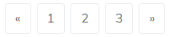

# Pagination

### **Simple pagination**

 To make pagination give class `pagination` to ul


### **Working with icons**

 To make pagination give class `pagination` to ul



### **Disabled and active states**

 To make pagination active or disable give class `.disabled & .active` to ul


### **Sizing Large**

 Fancy larger or smaller pagination? Add`.pagination-lg` for additional sizes.


### **Sizing Small**

 Fancy larger or smaller pagination? Add`.pagination-sm` for additional sizes.


### **Simple pagination with shadow**

 To make pagination give class `shadow-sm` or `shadow` or `shadow-lg` to li


```markup
<div class="row my-5">
    <div class="col-md-4 mb-3">
        <h4 class="card-title">Simple pagination</h4>
        <h6 class="card-subtitle text-muted mb-3">To make pagination give class <code>pagination</code> to ul</h6>
        <nav aria-label="Page navigation example">
            <ul class="pagination">
                <li class="page-item"><a class="page-link" href="#">Previous</a></li>
                <li class="page-item"><a class="page-link" href="#">1</a></li>
                <li class="page-item"><a class="page-link" href="#">2</a></li>
                <li class="page-item"><a class="page-link" href="#">3</a></li>
                <li class="page-item"><a class="page-link" href="#">Next</a></li>
            </ul>
        </nav>
    </div>
    <div class="col-md-4 mb-3">
        <h4 class="card-title">Working with icons</h4>
        <h6 class="card-subtitle text-muted mb-3">To make pagination give class <code>pagination</code> to ul</h6>
        <nav aria-label="Page navigation example">
            <ul class="pagination">
                <li class="page-item">
                    <a class="page-link" href="#" aria-label="Previous">
                        <span aria-hidden="true">«</span>
                        <span class="sr-only">Previous</span>
                    </a>
                </li>
                <li class="page-item"><a class="page-link" href="#">1</a></li>
                <li class="page-item"><a class="page-link" href="#">2</a></li>
                <li class="page-item"><a class="page-link" href="#">3</a></li>
                <li class="page-item">
                    <a class="page-link" href="#" aria-label="Next">
                        <span aria-hidden="true">»</span>
                        <span class="sr-only">Next</span>
                    </a>
                </li>
            </ul>
        </nav>
    </div>
    <div class="col-md-4 mb-3">
        <h4 class="card-title">Disabled and active states</h4>
        <h6 class="card-subtitle text-muted mb-3">To make pagination active or disable give class <code>.disabled &amp; .active</code> to ul</h6>
        <nav aria-label="...">
            <ul class="pagination">
                <li class="page-item disabled">
                    <a class="page-link" href="#" tabindex="-1">Previous</a>
                </li>
                <li class="page-item"><a class="page-link" href="#">1</a></li>
                <li class="page-item active">
                    <a class="page-link" href="#">2 <span class="sr-only">(current)</span></a>
                </li>
                <li class="page-item"><a class="page-link" href="#">3</a></li>
                <li class="page-item">
                    <a class="page-link" href="#">Next</a>
                </li>
            </ul>
        </nav>
    </div>
    <div class="col-md-6 mb-3">
        <h4 class="card-title">Sizing Large</h4>
        <h6 class="card-subtitle text-muted mb-3">Fancy larger or smaller pagination? Add<code>.pagination-lg </code> for additional sizes.</h6>
        <nav aria-label="...">
            <ul class="pagination pagination-lg">
                <li class="page-item disabled">
                    <a class="page-link" href="#" tabindex="-1">Previous</a>
                </li>
                <li class="page-item"><a class="page-link" href="#">1</a></li>
                <li class="page-item"><a class="page-link" href="#">2</a></li>
                <li class="page-item"><a class="page-link" href="#">3</a></li>
                <li class="page-item">
                    <a class="page-link" href="#">Next</a>
                </li>
            </ul>
        </nav>
    </div>
    <div class="col-md-6 mb-3">
        <h4 class="card-title">Sizing Small</h4>
        <h6 class="card-subtitle text-muted mb-3">Fancy larger or smaller pagination? Add<code>.pagination-sm </code> for additional sizes.</h6>
        <nav aria-label="...">
            <ul class="pagination pagination-sm">
                <li class="page-item disabled">
                    <a class="page-link" href="#" tabindex="-1">Previous</a>
                </li>
                <li class="page-item"><a class="page-link" href="#">1</a></li>
                <li class="page-item"><a class="page-link" href="#">2</a></li>
                <li class="page-item"><a class="page-link" href="#">3</a></li>
                <li class="page-item">
                    <a class="page-link" href="#">Next</a>
                </li>
            </ul>
        </nav>
    </div>

    <div class="col-12 mb-3">
        <h4 class="card-title">Simple pagination with shadow</h4>
        <h6 class="card-subtitle text-muted mb-3">To make pagination give class <code>shadow-sm</code> or <code>shadow</code> or <code>shadow-lg</code> to li</h6>
        <nav aria-label="Page navigation example">
            <ul class="pagination">
                <li class="page-item shadow-sm"><a class="page-link" href="#">Previous</a></li>
                <li class="page-item shadow-sm"><a class="page-link" href="#">1</a></li>
                <li class="page-item shadow-sm"><a class="page-link" href="#">2</a></li>
                <li class="page-item shadow-sm"><a class="page-link" href="#">3</a></li>
                <li class="page-item shadow-sm"><a class="page-link" href="#">Next</a></li>
            </ul>
        </nav>
    </div>
</div>
```

