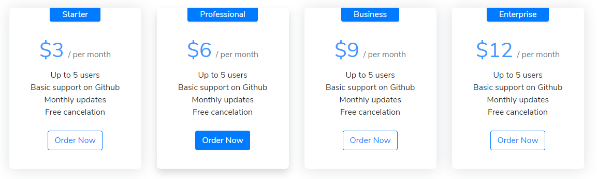
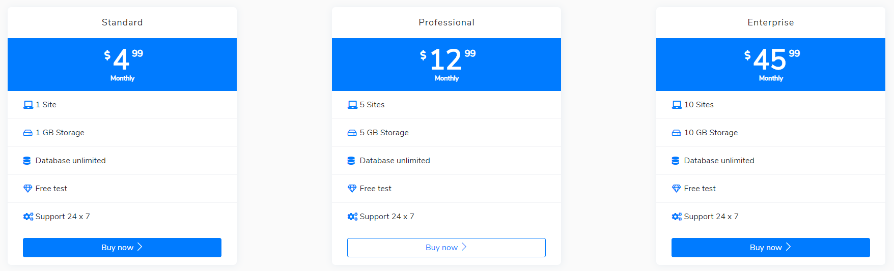
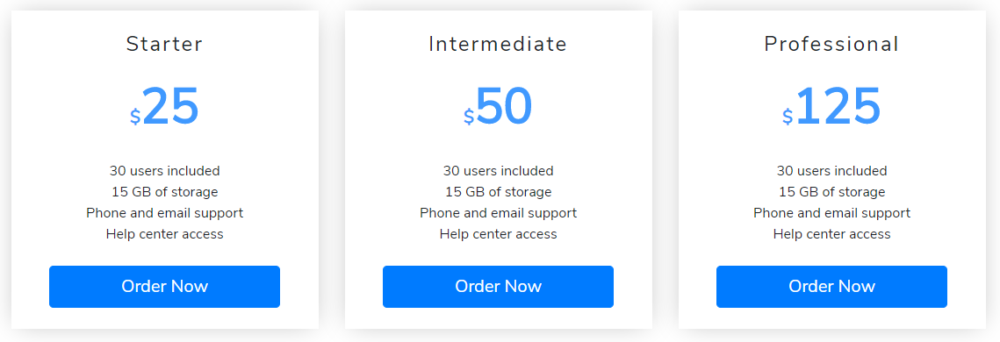

# Pricing Table

### Pricing Plan 1



```markup
<div class="row my-5">
    <div class="col-md-12 mb-3">
        <div class="pricing card-deck flex-column flex-md-row mb-3">
            <div class="card card-pricing text-center px-3 mb-4">
                <span class="h6 w-60 mx-auto px-4 py-1 rounded-bottom bg-primary text-white shadow-sm">Starter</span>
                <div class="bg-transparent card-header pt-4 border-0">
                    <h1 class="h1 font-weight-normal text-primary text-center mb-0" data-pricing-value="15">$<span class="price">3</span><span class="h6 text-muted ml-2">/ per month</span></h1>
                </div>
                <div class="card-body pt-0">
                    <ul class="list-unstyled mb-4">
                        <li>Up to 5 users</li>
                        <li>Basic support on Github</li>
                        <li>Monthly updates</li>
                        <li>Free cancelation</li>
                    </ul>
                    <a href="cart.html" target="_blank" class="btn btn-outline-primary mb-3">Order Now</a>
                </div>
            </div>
            <div class="card card-pricing popular shadow text-center px-3 mb-4">
                <span class="h6 w-60 mx-auto px-4 py-1 rounded-bottom bg-primary text-white shadow-sm">Professional</span>
                <div class="bg-transparent card-header pt-4 border-0">
                    <h1 class="h1 font-weight-normal text-primary text-center mb-0" data-pricing-value="30">$<span class="price">6</span><span class="h6 text-muted ml-2">/ per month</span></h1>
                </div>
                <div class="card-body pt-0">
                    <ul class="list-unstyled mb-4">
                        <li>Up to 5 users</li>
                        <li>Basic support on Github</li>
                        <li>Monthly updates</li>
                        <li>Free cancelation</li>
                    </ul>
                    <a href="cart.html" target="_blank" class="btn btn-primary mb-3">Order Now</a>
                </div>
            </div>
            <div class="card card-pricing text-center px-3 mb-4">
                <span class="h6 w-60 mx-auto px-4 py-1 rounded-bottom bg-primary text-white shadow-sm">Business</span>
                <div class="bg-transparent card-header pt-4 border-0">
                    <h1 class="h1 font-weight-normal text-primary text-center mb-0" data-pricing-value="45">$<span class="price">9</span><span class="h6 text-muted ml-2">/ per month</span></h1>
                </div>
                <div class="card-body pt-0">
                    <ul class="list-unstyled mb-4">
                        <li>Up to 5 users</li>
                        <li>Basic support on Github</li>
                        <li>Monthly updates</li>
                        <li>Free cancelation</li>
                    </ul>
                    <a href="cart.html" target="_blank" class="btn btn-outline-primary mb-3">Order Now</a>
                </div>
            </div>
            <div class="card card-pricing text-center px-3 mb-4">
                <span class="h6 w-60 mx-auto px-4 py-1 rounded-bottom bg-primary text-white shadow-sm">Enterprise</span>
                <div class="bg-transparent card-header pt-4 border-0">
                    <h1 class="h1 font-weight-normal text-primary text-center mb-0" data-pricing-value="60">$<span class="price">12</span><span class="h6 text-muted ml-2">/ per month</span></h1>
                </div>
                <div class="card-body pt-0">
                    <ul class="list-unstyled mb-4">
                        <li>Up to 5 users</li>
                        <li>Basic support on Github</li>
                        <li>Monthly updates</li>
                        <li>Free cancelation</li>
                    </ul>
                    <a href="cart.html" target="_blank" class="btn btn-outline-primary mb-3">Order Now</a>
                </div>
            </div>
        </div>
    </div>
</div>
```

### Pricing Plan 2



```markup
<div class="row">
    <div class="col-md-4 col-sm-4">
        <!-- price plans item begin -->
        <div class="b-price-plan">
            <div class="b-price-plan__item b-price-plan__head">
                <h3>Standard</h3>
            </div>
            <div class="b-price-plan__item b-price-plan__cost">
                <div class="cost-title">4<span>99</span></div>
                <div class="cost-time">Monthly</div>
            </div>
            <ul class="p_plan_list">
                <li><i class="fa fa-laptop" aria-hidden="true"></i> 1 Site</li>
                <li><i class="fa fa-hdd-o" aria-hidden="true"></i> 1 GB Storage</li>
                <li><i class="fa fa-database" aria-hidden="true"></i> Database unlimited</li>
                <li><i class="fa fa-diamond" aria-hidden="true"></i> Free test</li>
                <li><i class="fa fa-cogs" aria-hidden="true"></i> Support 24 x 7</li>
            </ul>
            <div class="b-price-plan__item price_foot">
                <a href="cart.html" class="btn btn-primary btn-block">
                    <span>Buy now</span> <i class="sl sl-icon-arrow-right"></i>
                </a>
            </div>
        </div>
        <!-- price plans item end -->
    </div>
    <div class="col-md-4 col-sm-4">
        <!-- price plans item begin -->
        <div class="b-price-plan">
            <div class="b-price-plan__item b-price-plan__head">
                <h3>Professional</h3>
            </div>
            <div class="b-price-plan__item b-price-plan__cost">
                <div class="cost-title">12<span>99</span></div>
                <div class="cost-time">Monthly</div>
            </div>
            <ul class="p_plan_list">
                <li><i class="fa fa-laptop" aria-hidden="true"></i> 5 Sites</li>
                <li><i class="fa fa-hdd-o" aria-hidden="true"></i> 5 GB Storage</li>
                <li><i class="fa fa-database" aria-hidden="true"></i> Database unlimited</li>
                <li><i class="fa fa-diamond" aria-hidden="true"></i> Free test</li>
                <li><i class="fa fa-cogs" aria-hidden="true"></i> Support 24 x 7</li>
            </ul>
            <div class="b-price-plan__item price_foot">
                <a href="cart.html" class="btn btn-outline-primary btn-block">
                    <span>Buy now</span> <i class="sl sl-icon-arrow-right"></i>
                </a>
            </div>
        </div>
        <!-- price plans item end -->
    </div>
    <div class="col-md-4 col-sm-4">
        <!-- price plans item begin -->
        <div class="b-price-plan">
            <div class="b-price-plan__item b-price-plan__head">
                <h3>Enterprise</h3>
            </div>
            <div class="b-price-plan__item b-price-plan__cost">
                <div class="cost-title">45<span>99</span></div>
                <div class="cost-time">Monthly</div>
            </div>
            <ul class="p_plan_list">
                <li><i class="fa fa-laptop" aria-hidden="true"></i> 10 Sites</li>
                <li><i class="fa fa-hdd-o" aria-hidden="true"></i> 10 GB Storage</li>
                <li><i class="fa fa-database" aria-hidden="true"></i> Database unlimited</li>
                <li><i class="fa fa-diamond" aria-hidden="true"></i> Free test</li>
                <li><i class="fa fa-cogs" aria-hidden="true"></i> Support 24 x 7</li>
            </ul>
            <div class="b-price-plan__item price_foot">
                <a href="cart.html" class="btn btn-primary btn-block">
                    <span>Buy now</span> <i class="sl sl-icon-arrow-right"></i>
                </a>
            </div>
        </div>
        <!-- price plans item end -->
    </div>
</div>
```

### Pricing Plan 3



```markup
<div class="row">
    <!-- Card #1, Starter -->
    <div class="col-lg-4 col-md-6 col-sm-10 pb-4 d-block m-auto">
        <div class="pricing-item" style="box-shadow: 0px 0px 30px -7px rgba(0, 0, 0, 0.29);">
            <!-- Indicator of subscription type -->
            <div class="pt-4 pb-3" style="letter-spacing: 2px;">
                <h4>Starter</h4>
            </div>
            <!-- Price class -->
            <div class="pricing-price pb-1 text-primary color-primary-text">
                <h1 style="font-weight: 1000; font-size: 3.5em;"><span style="font-size: 20px;">$</span>25</h1>
            </div>
            <!-- Perks of said subscription -->
            <div class="pricing-description">
                <ul class="list-unstyled mt-3 mb-4">
                    <li class="pl-3 pr-3">30 users included</li>
                    <li class="pl-3 pr-3">15 GB of storage</li>
                    <li class="pl-3 pr-3">Phone and email support</li>
                    <li class="pl-3 pr-3">Help center access</li>
                </ul>
            </div>
            <!-- Button -->
            <div class="pricing-button pb-4">
                <a href="cart.html" target="_blank" class="btn btn-lg btn-primary w-75">Order Now</a>
            </div>
        </div>
    </div>

    <!-- Card #2, Intermediate -->
    <div class="col-lg-4 col-md-6 col-sm-10 pb-4 d-block m-auto">
        <div class="pricing-item" style="box-shadow: 0px 0px 30px -7px rgba(0, 0, 0, 0.29);">
            <div class="pt-4 pb-3" style="letter-spacing: 2px;">
                <h4>Intermediate</h4>
            </div>
            <div class="pricing-price pb-1 text-primary color-primary-text">
                <h1 style="font-weight: 1000; font-size: 3.5em;"><span style="font-size: 20px;">$</span>50</h1>
            </div>
            <div class="pricing-description">
                <ul class="list-unstyled mt-3 mb-4">
                    <li class="pl-3 pr-3">30 users included</li>
                    <li class="pl-3 pr-3">15 GB of storage</li>
                    <li class="pl-3 pr-3">Phone and email support</li>
                    <li class="pl-3 pr-3">Help center access</li>
                </ul>
            </div>
            <div class="pricing-button pb-4">
                <a href="cart.html" target="_blank" class="btn btn-lg btn-primary w-75">Order Now</a>
            </div>
        </div>
    </div>

    <!-- Card #3, Professional -->
    <div class="col-lg-4 col-md-6 col-sm-10 pb-4 d-block m-auto">
        <div class="pricing-item" style="box-shadow: 0px 0px 30px -7px rgba(0, 0, 0, 0.29);">
            <div class="pt-4 pb-3" style="letter-spacing: 2px;">
                <h4>Professional</h4>
            </div>
            <div class="pricing-price pb-1 text-primary color-primary-text">
                <h1 style="font-weight: 1000; font-size: 3.5em;"><span style="font-size: 20px;">$</span>125</h1>
            </div>
            <div class="pricing-description">
                <ul class="list-unstyled mt-3 mb-4">
                    <li class="pl-3 pr-3">30 users included</li>
                    <li class="pl-3 pr-3">15 GB of storage</li>
                    <li class="pl-3 pr-3">Phone and email support</li>
                    <li class="pl-3 pr-3">Help center access</li>
                </ul>
            </div>
            <div class="pricing-button pb-4">
                <a href="cart.html" target="_blank" class="btn btn-lg btn-primary w-75">Order Now</a>
            </div>
        </div>
    </div>
</div>
```

