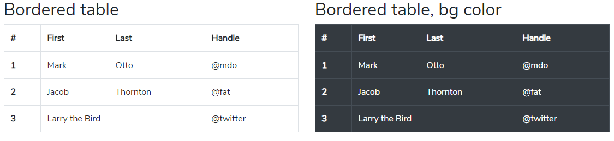
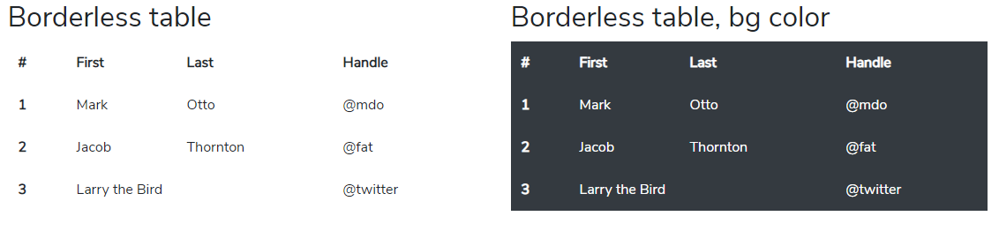
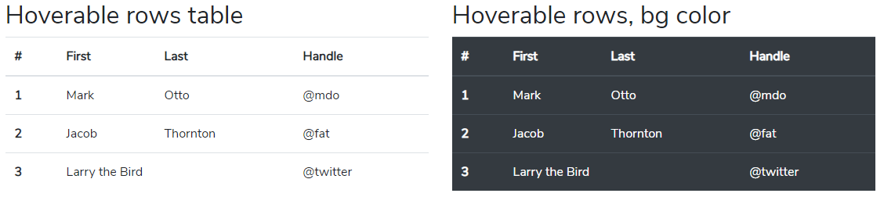
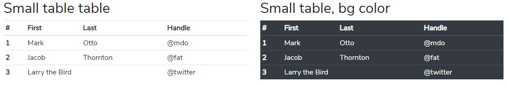
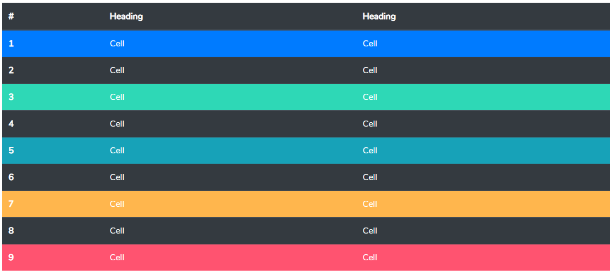
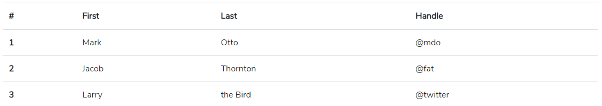

# Table

### Basic Table


```markup
<section id="table-1">
    <div class="container">
        <div class="row my-5">
            <div class="col-12 col-md-6">
                <h2>Basic Table</h2>
                <table class="table">
                    <thead>
                        <tr>
                            <th scope="col">#</th>
                            <th scope="col">First</th>
                            <th scope="col">Last</th>
                            <th scope="col">Handle</th>
                        </tr>
                    </thead>
                    <tbody>
                        <tr>
                            <th scope="row">1</th>
                            <td>Mark</td>
                            <td>Otto</td>
                            <td>@mdo</td>
                        </tr>
                        <tr>
                            <th scope="row">2</th>
                            <td>Jacob</td>
                            <td>Thornton</td>
                            <td>@fat</td>
                        </tr>
                        <tr>
                            <th scope="row">3</th>
                            <td>Larry</td>
                            <td>the Bird</td>
                            <td>@twitter</td>
                        </tr>
                    </tbody>
                </table>
            </div>
            <div class="col-12 col-md-6">
                <h2>Basic Table, bg color</h2>
                <table class="table table-dark">
                    <thead>
                        <tr>
                            <th scope="col">#</th>
                            <th scope="col">First</th>
                            <th scope="col">Last</th>
                            <th scope="col">Handle</th>
                        </tr>
                    </thead>
                    <tbody>
                        <tr>
                            <th scope="row">1</th>
                            <td>Mark</td>
                            <td>Otto</td>
                            <td>@mdo</td>
                        </tr>
                        <tr>
                            <th scope="row">2</th>
                            <td>Jacob</td>
                            <td>Thornton</td>
                            <td>@fat</td>
                        </tr>
                        <tr>
                            <th scope="row">3</th>
                            <td>Larry</td>
                            <td>the Bird</td>
                            <td>@twitter</td>
                        </tr>
                    </tbody>
                </table>
            </div>
        </div>
    </div>
</section>
```

### Table head options


```markup
<section id="table-2">
    <div class="container">
        <div class="row my-5">
            <div class="col-12">
                <h2>Table head options</h2>
                <table class="table">
                    <thead class="thead-dark">
                        <tr>
                            <th scope="col">#</th>
                            <th scope="col">First</th>
                            <th scope="col">Last</th>
                            <th scope="col">Handle</th>
                        </tr>
                    </thead>
                    <tbody>
                        <tr>
                            <th scope="row">1</th>
                            <td>Mark</td>
                            <td>Otto</td>
                            <td>@mdo</td>
                        </tr>
                        <tr>
                            <th scope="row">2</th>
                            <td>Jacob</td>
                            <td>Thornton</td>
                            <td>@fat</td>
                        </tr>
                        <tr>
                            <th scope="row">3</th>
                            <td>Larry</td>
                            <td>the Bird</td>
                            <td>@twitter</td>
                        </tr>
                    </tbody>
                </table>
                <table class="table">
                    <thead class="thead-light">
                        <tr>
                            <th scope="col">#</th>
                            <th scope="col">First</th>
                            <th scope="col">Last</th>
                            <th scope="col">Handle</th>
                        </tr>
                    </thead>
                    <tbody>
                        <tr>
                            <th scope="row">1</th>
                            <td>Mark</td>
                            <td>Otto</td>
                            <td>@mdo</td>
                        </tr>
                        <tr>
                            <th scope="row">2</th>
                            <td>Jacob</td>
                            <td>Thornton</td>
                            <td>@fat</td>
                        </tr>
                        <tr>
                            <th scope="row">3</th>
                            <td>Larry</td>
                            <td>the Bird</td>
                            <td>@twitter</td>
                        </tr>
                    </tbody>
                </table>
            </div>
        </div>
    </div>
</section>
```

### Table Striped rows


```markup
<section id="table-3">
    <div class="container">
        <div class="row my-5">
            <div class="col-12 col-md-6">
                <h2>Table Striped rows</h2>
                <table class="table table-striped">
                    <thead>
                        <tr>
                            <th scope="col">#</th>
                            <th scope="col">First</th>
                            <th scope="col">Last</th>
                            <th scope="col">Handle</th>
                        </tr>
                    </thead>
                    <tbody>
                        <tr>
                            <th scope="row">1</th>
                            <td>Mark</td>
                            <td>Otto</td>
                            <td>@mdo</td>
                        </tr>
                        <tr>
                            <th scope="row">2</th>
                            <td>Jacob</td>
                            <td>Thornton</td>
                            <td>@fat</td>
                        </tr>
                        <tr>
                            <th scope="row">3</th>
                            <td>Larry</td>
                            <td>the Bird</td>
                            <td>@twitter</td>
                        </tr>
                    </tbody>
                </table>
            </div>
            <div class="col-12 col-md-6">
                <h2>Table Striped rows, bg color</h2>
                <table class="table table-striped table-dark">
                    <thead>
                        <tr>
                            <th scope="col">#</th>
                            <th scope="col">First</th>
                            <th scope="col">Last</th>
                            <th scope="col">Handle</th>
                        </tr>
                    </thead>
                    <tbody>
                        <tr>
                            <th scope="row">1</th>
                            <td>Mark</td>
                            <td>Otto</td>
                            <td>@mdo</td>
                        </tr>
                        <tr>
                            <th scope="row">2</th>
                            <td>Jacob</td>
                            <td>Thornton</td>
                            <td>@fat</td>
                        </tr>
                        <tr>
                            <th scope="row">3</th>
                            <td>Larry</td>
                            <td>the Bird</td>
                            <td>@twitter</td>
                        </tr>
                    </tbody>
                </table>
            </div>
        </div>
    </div>
</section>
```

### Bordered table



```markup
<section id="table-4">
    <div class="container">
        <div class="row my-5">
            <div class="col-12 col-md-6">
                <h2>Bordered table</h2>
                <table class="table table-bordered">
                    <thead>
                        <tr>
                            <th scope="col">#</th>
                            <th scope="col">First</th>
                            <th scope="col">Last</th>
                            <th scope="col">Handle</th>
                        </tr>
                    </thead>
                    <tbody>
                        <tr>
                            <th scope="row">1</th>
                            <td>Mark</td>
                            <td>Otto</td>
                            <td>@mdo</td>
                        </tr>
                        <tr>
                            <th scope="row">2</th>
                            <td>Jacob</td>
                            <td>Thornton</td>
                            <td>@fat</td>
                        </tr>
                        <tr>
                            <th scope="row">3</th>
                            <td colspan="2">Larry the Bird</td>
                            <td>@twitter</td>
                        </tr>
                    </tbody>
                </table>
            </div>
            <div class="col-12 col-md-6">
                <h2>Bordered table, bg color</h2>
                <table class="table table-bordered table-dark">
                    <thead>
                        <tr>
                            <th scope="col">#</th>
                            <th scope="col">First</th>
                            <th scope="col">Last</th>
                            <th scope="col">Handle</th>
                        </tr>
                    </thead>
                    <tbody>
                        <tr>
                            <th scope="row">1</th>
                            <td>Mark</td>
                            <td>Otto</td>
                            <td>@mdo</td>
                        </tr>
                        <tr>
                            <th scope="row">2</th>
                            <td>Jacob</td>
                            <td>Thornton</td>
                            <td>@fat</td>
                        </tr>
                        <tr>
                            <th scope="row">3</th>
                            <td colspan="2">Larry the Bird</td>
                            <td>@twitter</td>
                        </tr>
                    </tbody>
                </table>
            </div>
        </div>
    </div>
</section>
```

### Borderless table



```markup
<section id="table-5">
    <div class="container">
        <div class="row my-5">
            <div class="col-12 col-md-6">
                <h2>Borderless table</h2>
                <table class="table table-borderless">
                    <thead>
                        <tr>
                            <th scope="col">#</th>
                            <th scope="col">First</th>
                            <th scope="col">Last</th>
                            <th scope="col">Handle</th>
                        </tr>
                    </thead>
                    <tbody>
                        <tr>
                            <th scope="row">1</th>
                            <td>Mark</td>
                            <td>Otto</td>
                            <td>@mdo</td>
                        </tr>
                        <tr>
                            <th scope="row">2</th>
                            <td>Jacob</td>
                            <td>Thornton</td>
                            <td>@fat</td>
                        </tr>
                        <tr>
                            <th scope="row">3</th>
                            <td colspan="2">Larry the Bird</td>
                            <td>@twitter</td>
                        </tr>
                    </tbody>
                </table>
            </div>
            <div class="col-12 col-md-6">
                <h2>Borderless table, bg color</h2>
                <table class="table table-borderless table-dark">
                    <thead>
                        <tr>
                            <th scope="col">#</th>
                            <th scope="col">First</th>
                            <th scope="col">Last</th>
                            <th scope="col">Handle</th>
                        </tr>
                    </thead>
                    <tbody>
                        <tr>
                            <th scope="row">1</th>
                            <td>Mark</td>
                            <td>Otto</td>
                            <td>@mdo</td>
                        </tr>
                        <tr>
                            <th scope="row">2</th>
                            <td>Jacob</td>
                            <td>Thornton</td>
                            <td>@fat</td>
                        </tr>
                        <tr>
                            <th scope="row">3</th>
                            <td colspan="2">Larry the Bird</td>
                            <td>@twitter</td>
                        </tr>
                    </tbody>
                </table>
            </div>
        </div>
    </div>
</section>
```

### Hoverable rows table



```markup
<section id="table-6">
    <div class="container">
        <div class="row my-5">
            <div class="col-12 col-md-6">
                <h2>Hoverable rows table</h2>
                <table class="table table-hover">
                    <thead>
                        <tr>
                            <th scope="col">#</th>
                            <th scope="col">First</th>
                            <th scope="col">Last</th>
                            <th scope="col">Handle</th>
                        </tr>
                    </thead>
                    <tbody>
                        <tr>
                            <th scope="row">1</th>
                            <td>Mark</td>
                            <td>Otto</td>
                            <td>@mdo</td>
                        </tr>
                        <tr>
                            <th scope="row">2</th>
                            <td>Jacob</td>
                            <td>Thornton</td>
                            <td>@fat</td>
                        </tr>
                        <tr>
                            <th scope="row">3</th>
                            <td colspan="2">Larry the Bird</td>
                            <td>@twitter</td>
                        </tr>
                    </tbody>
                </table>
            </div>
            <div class="col-12 col-md-6">
                <h2>Hoverable rows, bg color</h2>
                <table class="table table-hover table-dark">
                    <thead>
                        <tr>
                            <th scope="col">#</th>
                            <th scope="col">First</th>
                            <th scope="col">Last</th>
                            <th scope="col">Handle</th>
                        </tr>
                    </thead>
                    <tbody>
                        <tr>
                            <th scope="row">1</th>
                            <td>Mark</td>
                            <td>Otto</td>
                            <td>@mdo</td>
                        </tr>
                        <tr>
                            <th scope="row">2</th>
                            <td>Jacob</td>
                            <td>Thornton</td>
                            <td>@fat</td>
                        </tr>
                        <tr>
                            <th scope="row">3</th>
                            <td colspan="2">Larry the Bird</td>
                            <td>@twitter</td>
                        </tr>
                    </tbody>
                </table>
            </div>
        </div>
    </div>
</section>
```

### Small table table



```markup
<section id="table-7">
    <div class="container">
        <div class="row my-5">
            <div class="col-12 col-md-6">
                <h2>Small table table</h2>
                <table class="table table-sm">
                    <thead>
                        <tr>
                            <th scope="col">#</th>
                            <th scope="col">First</th>
                            <th scope="col">Last</th>
                            <th scope="col">Handle</th>
                        </tr>
                    </thead>
                    <tbody>
                        <tr>
                            <th scope="row">1</th>
                            <td>Mark</td>
                            <td>Otto</td>
                            <td>@mdo</td>
                        </tr>
                        <tr>
                            <th scope="row">2</th>
                            <td>Jacob</td>
                            <td>Thornton</td>
                            <td>@fat</td>
                        </tr>
                        <tr>
                            <th scope="row">3</th>
                            <td colspan="2">Larry the Bird</td>
                            <td>@twitter</td>
                        </tr>
                    </tbody>
                </table>
            </div>
            <div class="col-12 col-md-6">
                <h2>Small table, bg color</h2>
                <table class="table table-sm table-dark">
                    <thead>
                        <tr>
                            <th scope="col">#</th>
                            <th scope="col">First</th>
                            <th scope="col">Last</th>
                            <th scope="col">Handle</th>
                        </tr>
                    </thead>
                    <tbody>
                        <tr>
                            <th scope="row">1</th>
                            <td>Mark</td>
                            <td>Otto</td>
                            <td>@mdo</td>
                        </tr>
                        <tr>
                            <th scope="row">2</th>
                            <td>Jacob</td>
                            <td>Thornton</td>
                            <td>@fat</td>
                        </tr>
                        <tr>
                            <th scope="row">3</th>
                            <td colspan="2">Larry the Bird</td>
                            <td>@twitter</td>
                        </tr>
                    </tbody>
                </table>
            </div>
        </div>
    </div>
</section>
```

### Contextual classes


```markup
<section id="table-8" class="">
    <div class="container">
        <div class="row my-5">
            <div class="col-12">
                <h2 class="">Contextual classes</h2>
                <table class="table">
                    <thead>
                        <tr>
                            <th scope="col" class="">Class</th>
                            <th scope="col">Heading</th>
                            <th scope="col">Heading</th>
                        </tr>
                    </thead>
                    <tbody>
                        <tr class="table-active">
                            <th scope="row">Active</th>
                            <td>Cell</td>
                            <td>Cell</td>
                        </tr>
                        <tr>
                            <th scope="row">Default</th>
                            <td>Cell</td>
                            <td>Cell</td>
                        </tr>
                        <tr class="table-primary">
                            <th scope="row">Primary</th>
                            <td>Cell</td>
                            <td>Cell</td>
                        </tr>
                        <tr class="table-secondary">
                            <th scope="row">Secondary</th>
                            <td>Cell</td>
                            <td>Cell</td>
                        </tr>
                        <tr class="table-success">
                            <th scope="row">Success</th>
                            <td>Cell</td>
                            <td>Cell</td>
                        </tr>
                        <tr class="table-danger">
                            <th scope="row">Danger</th>
                            <td>Cell</td>
                            <td>Cell</td>
                        </tr>
                        <tr class="table-warning">
                            <th scope="row">Warning</th>
                            <td>Cell</td>
                            <td>Cell</td>
                        </tr>
                        <tr class="table-info">
                            <th scope="row">Info</th>
                            <td>Cell</td>
                            <td>Cell</td>
                        </tr>
                        <tr class="table-light">
                            <th scope="row">Light</th>
                            <td>Cell</td>
                            <td>Cell</td>
                        </tr>
                        <tr class="table-dark">
                            <th scope="row">Dark</th>
                            <td>Cell</td>
                            <td>Cell</td>
                        </tr>
                    </tbody>
                </table>
            </div>
        </div>
    </div>
</section>
```

Regular table background variants are not available with the dark table, however, you may use text or background utilities to achieve similar styles.



```markup
<section id="table-9">
    <div class="container">
        <div class="row my-5">
            <div class="col-12">
                <p>Regular table background variants are not available with the dark table, however, you may use text or background utilities to achieve similar styles.</p>
                <table class="table table-dark">
                    <thead>
                        <tr>
                            <th scope="col">#</th>
                            <th scope="col">Heading</th>
                            <th scope="col">Heading</th>
                        </tr>
                    </thead>
                    <tbody>
                        <tr class="bg-primary">
                            <th scope="row">1</th>
                            <td>Cell</td>
                            <td>Cell</td>
                        </tr>
                        <tr>
                            <th scope="row">2</th>
                            <td>Cell</td>
                            <td>Cell</td>
                        </tr>
                        <tr class="bg-success">
                            <th scope="row">3</th>
                            <td>Cell</td>
                            <td>Cell</td>
                        </tr>
                        <tr>
                            <th scope="row">4</th>
                            <td>Cell</td>
                            <td>Cell</td>
                        </tr>
                        <tr class="bg-info">
                            <th scope="row">5</th>
                            <td>Cell</td>
                            <td>Cell</td>
                        </tr>
                        <tr>
                            <th scope="row">6</th>
                            <td>Cell</td>
                            <td>Cell</td>
                        </tr>
                        <tr class="bg-warning">
                            <th scope="row">7</th>
                            <td>Cell</td>
                            <td>Cell</td>
                        </tr>
                        <tr>
                            <th scope="row">8</th>
                            <td>Cell</td>
                            <td>Cell</td>
                        </tr>
                        <tr class="bg-danger">
                            <th scope="row">9</th>
                            <td>Cell</td>
                            <td>Cell</td>
                        </tr>
                    </tbody>
                </table>
            </div>
        </div>
    </div>
</section>
```

Regular table background variants are not available with the dark table, however, you may use text or background utilities to achieve similar styles.



```markup
<section id="table-10">
    <div class="container">
        <div class="row my-5">
            <div class="col-12">
                <p>Regular table background variants are not available with the dark table, however, you may use text or background utilities to achieve similar styles.</p>
                <table class="table">
                    <caption>List of users</caption>
                    <thead>
                        <tr>
                            <th scope="col">#</th>
                            <th scope="col">First</th>
                            <th scope="col">Last</th>
                            <th scope="col">Handle</th>
                        </tr>
                    </thead>
                    <tbody>
                        <tr>
                            <th scope="row">1</th>
                            <td>Mark</td>
                            <td>Otto</td>
                            <td>@mdo</td>
                        </tr>
                        <tr>
                            <th scope="row">2</th>
                            <td>Jacob</td>
                            <td>Thornton</td>
                            <td>@fat</td>
                        </tr>
                        <tr>
                            <th scope="row">3</th>
                            <td>Larry</td>
                            <td>the Bird</td>
                            <td>@twitter</td>
                        </tr>
                    </tbody>
                </table>
            </div>
        </div>
    </div>
</section>
```

### Responsive tables

 Responsive tables allow tables to be scrolled horizontally with ease. Make any table responsive across all viewports by wrapping a `.table` with `.table-responsive`. Or, pick a maximum breakpoint with which to have a responsive table up to by using `.table-responsive{-sm|-md|-lg|-xl}`.


```markup
<section id="table-9">
    <div class="container">
        <div class="row my-5">
            <div class="col-12">
                <h2>Responsive tables</h2>
                <p>Responsive tables allow tables to be scrolled horizontally with ease. Make any table responsive across all viewports by wrapping a <code class="highlighter-rouge">.table</code> with <code class="highlighter-rouge">.table-responsive</code>.
                    Or, pick a maximum breakpoint with which to have a responsive table up to by using <code class="highlighter-rouge">.table-responsive{-sm|-md|-lg|-xl}</code>.</p>
                <div class="table-responsive">
                    <table class="table">
                        <thead>
                            <tr>
                                <th scope="col">#</th>
                                <th scope="col">First</th>
                                <th scope="col">Last</th>
                                <th scope="col">Handle</th>
                            </tr>
                        </thead>
                        <tbody>
                            <tr>
                                <th scope="row">1</th>
                                <td>Mark</td>
                                <td>Otto</td>
                                <td>@mdo</td>
                            </tr>
                            <tr>
                                <th scope="row">2</th>
                                <td>Jacob</td>
                                <td>Thornton</td>
                                <td>@fat</td>
                            </tr>
                            <tr>
                                <th scope="row">3</th>
                                <td>Larry</td>
                                <td>the Bird</td>
                                <td>@twitter</td>
                            </tr>
                        </tbody>
                    </table>
                </div>
            </div>
        </div>
    </div>
</section>
```

