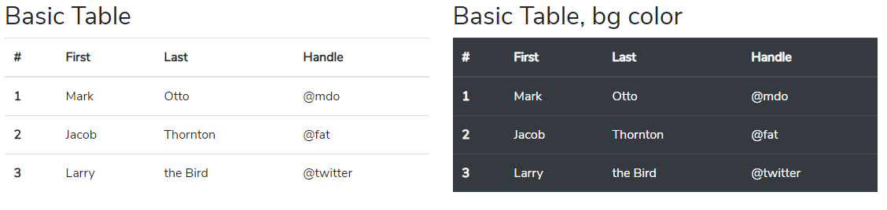

# Table

### Basic Table



```markup
<section id="table-1">
    <div class="container">
        <div class="row my-5">
            <div class="col-12 col-md-6">
                <h2>Basic Table</h2>
                <table class="table">
                    <thead>
                        <tr>
                            <th scope="col">#</th>
                            <th scope="col">First</th>
                            <th scope="col">Last</th>
                            <th scope="col">Handle</th>
                        </tr>
                    </thead>
                    <tbody>
                        <tr>
                            <th scope="row">1</th>
                            <td>Mark</td>
                            <td>Otto</td>
                            <td>@mdo</td>
                        </tr>
                        <tr>
                            <th scope="row">2</th>
                            <td>Jacob</td>
                            <td>Thornton</td>
                            <td>@fat</td>
                        </tr>
                        <tr>
                            <th scope="row">3</th>
                            <td>Larry</td>
                            <td>the Bird</td>
                            <td>@twitter</td>
                        </tr>
                    </tbody>
                </table>
            </div>
            <div class="col-12 col-md-6">
                <h2>Basic Table, bg color</h2>
                <table class="table table-dark">
                    <thead>
                        <tr>
                            <th scope="col">#</th>
                            <th scope="col">First</th>
                            <th scope="col">Last</th>
                            <th scope="col">Handle</th>
                        </tr>
                    </thead>
                    <tbody>
                        <tr>
                            <th scope="row">1</th>
                            <td>Mark</td>
                            <td>Otto</td>
                            <td>@mdo</td>
                        </tr>
                        <tr>
                            <th scope="row">2</th>
                            <td>Jacob</td>
                            <td>Thornton</td>
                            <td>@fat</td>
                        </tr>
                        <tr>
                            <th scope="row">3</th>
                            <td>Larry</td>
                            <td>the Bird</td>
                            <td>@twitter</td>
                        </tr>
                    </tbody>
                </table>
            </div>
        </div>
    </div>
</section>
```

### Table head options


```markup
<section id="table-2">
    <div class="container">
        <div class="row my-5">
            <div class="col-12">
                <h2>Table head options</h2>
                <table class="table">
                    <thead class="thead-dark">
                        <tr>
                            <th scope="col">#</th>
                            <th scope="col">First</th>
                            <th scope="col">Last</th>
                            <th scope="col">Handle</th>
                        </tr>
                    </thead>
                    <tbody>
                        <tr>
                            <th scope="row">1</th>
                            <td>Mark</td>
                            <td>Otto</td>
                            <td>@mdo</td>
                        </tr>
                        <tr>
                            <th scope="row">2</th>
                            <td>Jacob</td>
                            <td>Thornton</td>
                            <td>@fat</td>
                        </tr>
                        <tr>
                            <th scope="row">3</th>
                            <td>Larry</td>
                            <td>the Bird</td>
                            <td>@twitter</td>
                        </tr>
                    </tbody>
                </table>
                <table class="table">
                    <thead class="thead-light">
                        <tr>
                            <th scope="col">#</th>
                            <th scope="col">First</th>
                            <th scope="col">Last</th>
                            <th scope="col">Handle</th>
                        </tr>
                    </thead>
                    <tbody>
                        <tr>
                            <th scope="row">1</th>
                            <td>Mark</td>
                            <td>Otto</td>
                            <td>@mdo</td>
                        </tr>
                        <tr>
                            <th scope="row">2</th>
                            <td>Jacob</td>
                            <td>Thornton</td>
                            <td>@fat</td>
                        </tr>
                        <tr>
                            <th scope="row">3</th>
                            <td>Larry</td>
                            <td>the Bird</td>
                            <td>@twitter</td>
                        </tr>
                    </tbody>
                </table>
            </div>
        </div>
    </div>
</section>
```

### Table Striped rows


