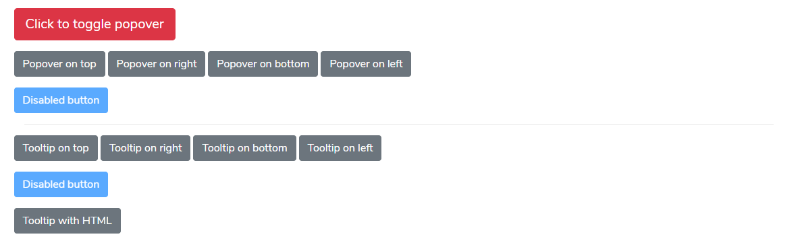

# Tooltip & Popovers



### Example: Enable tooltips everywhere

One way to initialize all tooltips on a page would be to select them by their data-toggle attribute:

```javascript
$(function () {
  $('[data-toggle="tooltip"]').tooltip()
})
```

### Example: Enable popovers everywhere

 One way to initialize all popovers on a page would be to select them by their `data-toggle` attribute:

```javascript
$(function () {
  $('[data-toggle="popover"]').popover()
})
```

### HTML Example

```markup
<div class="container">
    <div class="row my-3">
        <button type="button" class="btn btn-lg btn-danger" data-toggle="popover" title="" data-content="And here's some amazing content. It's very engaging. Right?" data-original-title="Popover title">Click to toggle popover</button>
    </div>
    <div class="row my-3">
        <button type="button" class="btn btn-secondary mr-1" data-container="body" data-toggle="popover" data-placement="top" data-content="Vivamus sagittis lacus vel augue laoreet rutrum faucibus." data-original-title="" title="">
            Popover on top
        </button>

        <button type="button" class="btn btn-secondary mr-1" data-container="body" data-toggle="popover" data-placement="right" data-content="Vivamus sagittis lacus vel augue laoreet rutrum faucibus." data-original-title="" title="">
            Popover on right
        </button>

        <button type="button" class="btn btn-secondary mr-1" data-container="body" data-toggle="popover" data-placement="bottom" data-content="Vivamus
      sagittis lacus vel augue laoreet rutrum faucibus." data-original-title="" title="">
            Popover on bottom
        </button>

        <button type="button" class="btn btn-secondary mr-1" data-container="body" data-toggle="popover" data-placement="left" data-content="Vivamus sagittis lacus vel augue laoreet rutrum faucibus." data-original-title="" title="">
            Popover on left
        </button>
    </div>
    <div class="row my-3">
        <span class="d-inline-block" data-toggle="popover" data-content="Disabled popover" data-original-title="" title="">
            <button class="btn btn-primary" style="pointer-events: none;" type="button" disabled="">Disabled button</button>
        </span>
    </div>
    <hr>
    <div class="row my-3">
        <button type="button" class="btn btn-secondary mr-1" data-toggle="tooltip" data-placement="top" title="" data-original-title="Tooltip on top">
            Tooltip on top
        </button>
        <button type="button" class="btn btn-secondary mr-1" data-toggle="tooltip" data-placement="right" title="" data-original-title="Tooltip on right">
            Tooltip on right
        </button>
        <button type="button" class="btn btn-secondary mr-1" data-toggle="tooltip" data-placement="bottom" title="" data-original-title="Tooltip on bottom">
            Tooltip on bottom
        </button>
        <button type="button" class="btn btn-secondary mr-1" data-toggle="tooltip" data-placement="left" title="" data-original-title="Tooltip on left">
            Tooltip on left
        </button>
    </div>
    <div class="row my-3">
        <span class="d-inline-block" tabindex="0" data-toggle="tooltip" title="" data-original-title="Disabled tooltip">
            <button class="btn btn-primary" style="pointer-events: none;" type="button" disabled="">Disabled button</button>
        </span>
    </div>
    <div class="row">
        <button type="button" class="btn btn-secondary" data-toggle="tooltip" data-html="true" title="" data-original-title="<em>Tooltip</em> <u>with</u> <b>HTML</b>">
            Tooltip with HTML
        </button>
    </div>
</div>
```

